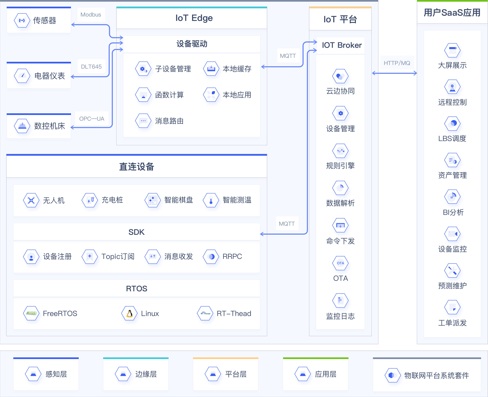

# 物联网平台系统套件

物联网平台系统套件（IoT Stack）是集物联网通信平台、边缘网关（含子设备驱动）、直连设备SDK等功能为一体的完整物联网解决方案平台产品，可私有化部署在任意IaaS上。

IoT Stack（本文档中简称为IoT平台）为设备数据采集及和产业互联网数字化转型提供重要支撑，IoT平台支持海量设备的连接，方便设备数据采集；同时提供平台API，方便用户快速应用开发，缩短用户开发周期，减少运维成本。边缘网关是物联网通信云平台在边缘端的延伸，可以实现子设备的数据采集，数据的解析、清洗、加工、聚合、缓存，现场实时控制，本地场景联动等。

## 产品优势

**私有化部署**

整套IoT平台可私有化部署，支持集群或单机运行。满足高等级数据保护要求及私域业务场景需求。

**海量设备接入**

海量设备的长连接与数据并发能力，可支持百万级消息并发及亿级别设备接入，提供稳定的数据通信服务。

**数据流转灵活**

规则引擎提供多种数据流转方式，可实现数据与其他应用产品的流转，满足设备与设备（M2M）之间的通信。

**多行业协议方便接入**

提供子设备驱动（子设备协议接入框架）。定义了子设备绑定到网关后的一系列功能实现机制，包括设备上下线、设备配置、协议解析、上报消息、下行控制。并提供支持Modbus、DLT645协议的官方驱动。

**边缘网关快速部署**

一键部署。不论是添加子设备、函数计算、本地应用、消息路由还是配置子设备驱动都可以直接在IoT平台完成，一键部署同步到边缘网关。

**边缘端编排处理，实时控制**

边缘网关支持函数计算、本地应用，实时处理本地数据及消息事件，做到快速响应，有效避免因为网络抖动、网络中断等引起的控制延时或控制消息丢失。消息路由可以方便进行处理的灵活编排。

**上云数据清洗降低成本**

边缘网关的函数计算、本地应用功能可以对本地数据进行清洗、聚合处理，对设备上报的大量重复性数据进行清洗或者聚合后再上报到IoT平台，节约上行流量，降低成本。数据清洗还可以对某些数据进行脱敏处理，实现非敏感数据的上报。

**应用开发简单高效**

提供规则引擎、RRPC、设备端接入SDK、数据解析、函数计算、本地应用、开放API等功能，降低物联网应用的开发难度，减少开发工作量，提高整体开发效率。

**服务安全可靠**

完善的设备注册机制保障连接IoT平台的设备的唯一性及安全性，数据传输加密保证数据不外泄、不篡改。

## 核心功能

**设备接入**

基于MQTT协议通信。支持海量设备的长连接能力与并发数据交换能力，提供批量注册、动态注册等设备管理方式。

**规则引擎**

规则引擎可对Topic中的数据进行过滤处理，将处理后的数据发送到其他应用产品中（如MySQL、MongoDB、PgSQL、Kafka、TSDB服务等），或将数据通过HTTP协议直接转发到业务服务器，也支持转发其他物联网设备（M2M）。

**数据解析**

在通信云平台上，可支持将设备透传的原数据通过脚本进行解析处理成JSON后使用。

**边缘网关管理**

提供边缘网关全生命周期管理，包括网关添加、激活、上线、离线、删除等。

**子设备管理及拓扑添加**

提供子设备全生命周期管理，以及子设备绑定到网关。

**驱动管理**

提供子设备驱动管理（协议、开发语言、适用硬件架构），以及驱动分配到网关设备。

**函数计算**

提供函数计算的管理，可以在线编辑函数逻辑，分配到边缘网关，适用轻量级数据过滤/处理、应用的调用编排等场景。

**本地应用**

可将用户自己的本地应用，集成到网关的服务治理与消息路由体系中，灵活扩展边缘的业务处理能力。

**消息路由**

提供边缘网关侧子设备、函数计算、本地应用、IoT平台四者之间的消息流转，数据分析处理的编排。

**远程SSH运维**

提供远程运维，云端可以安全远程登录到边缘网关，管理网关设备。

## 适用场景

**工业领域**

工业生产，如机床加工，IoT平台可采集生产设备的工作状态、设备负载等信息，为综合效率计算、产能评估、产能预测、优化参数、预测维护提供分析素材与决策依据。在智慧工厂，各类机器安装有大量传感器，从传感器数据采集、数据解析、网络传输、业务服务处理、平台下发反向控制指令，再传回给工厂机器，路径很长，会有较明显延迟。边缘网关的消息路由、函数计算功能可以很好的实现本地实时控制、就近处理。

**智慧城市**

环境监控类传感器接入IoT平台，可实现城市水质、空气质量、路灯、井盖等检测。市政类安防、消防、人流监控设备接入IoT平台可实现安全隐患预警。此类业务通常拥有大量检测设备，传感器每时每刻产生大量的数据，这些数据有很多是重复冗余的，如果将这些数据都传输到平台业务端将是一笔不小的开销，而且也没有必要。边缘网关能够有效的对数据进行聚合、清洗，让有用、关键数据上报到平台业务端，降低成本。

**能源电力领域**

在电气领域及工业领域，一些采集卡、DDC设备、PLC设备使用不同的行业协议，比如BACnet、Lonwork、Modbus、DeviceNet、ProfibusDP、EtherNet/IP，边缘网关提供一套完整的设备接入驱动框架，可以基于该框架完成设备的数据解析、数据上下线控制、数据上报业务端。

**物流领域**

物流仓储可通过RFID技术，将货物存放位置信息上报到IoT平台，实现货物资产管理自动化。货物运输过程，可通过类似技术，实现运单轨迹可视化，电子围栏确认等自动化功能，提升物流效率。

**农业领域**

农业场景，如大棚种植，各类传感器上传数据到IoT平台，根据大棚的各类实时状态信息，调节放风机、喷洒系统，实现农业场景的无人化。

## 业务架构

