# 固件升级控制台操作指南

## 功能入口及主要功能分布

**功能入口**

【IoT平台首页】==>【产品设备管理】==>【产品操作】==>【固件升级】

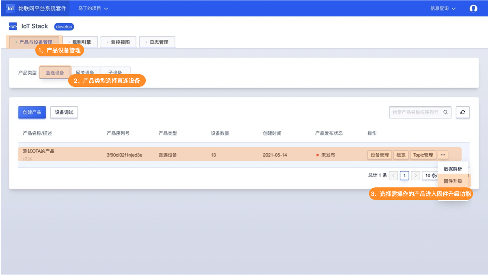

**主要功能分布**

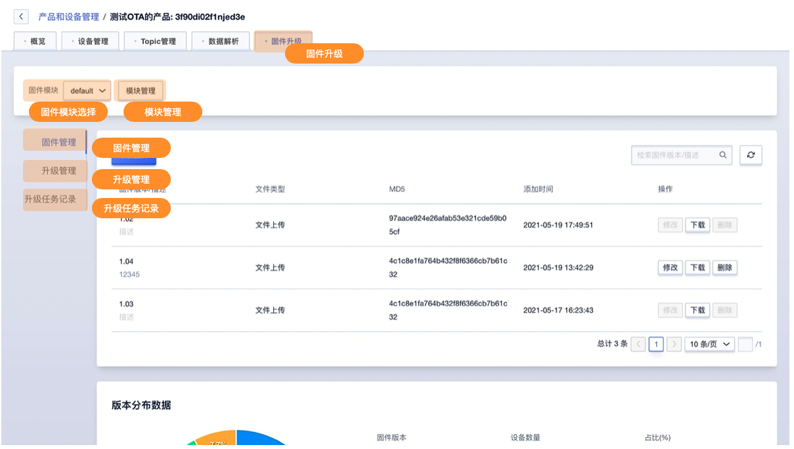

## 模块管理

**固件模块管理**

模块管理可进行固件模块的添加及删除。IoT平台提供一个默认模块【defaul】，该模块不可删除修改。一个产品下可额外创建10个固件模块。如需删除固件模块需先删除其下所有固件版本。

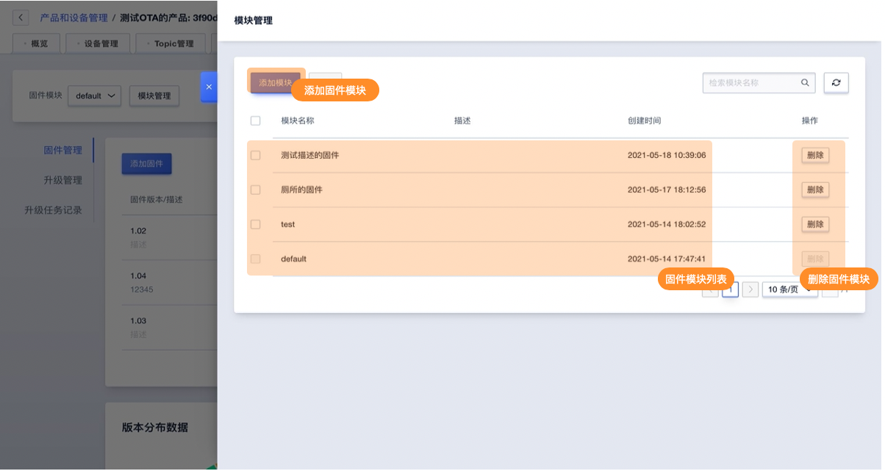

**添加固件模块**

按照提供填写固件版本信息即可创建，固件模块添加后不可修改。

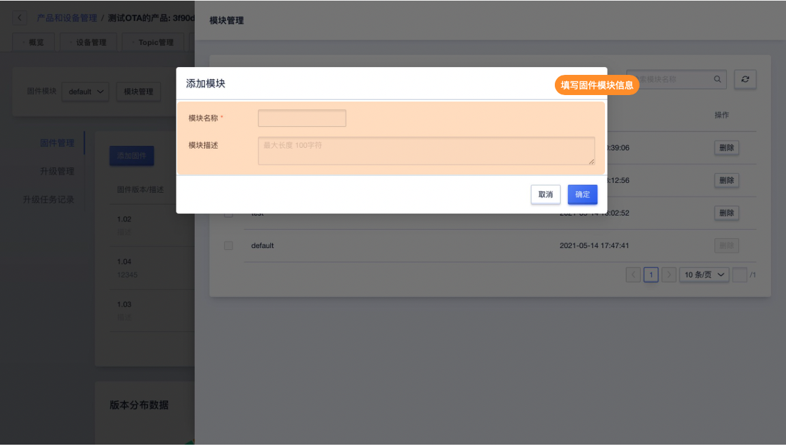

## 固件管理

固件管理主要为模块下的固件版本管理及当前固件模块下的固件版本分布展示。

**固件管理功能页面**

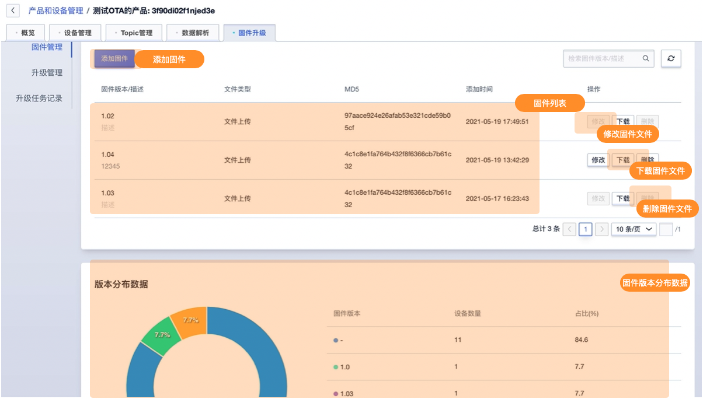

**固件列表**

展示当前固件模块下已经添加的固件版本信息，可对固件版本进行修改、删除操作并可下载固件文件。删除固件版本或修改固件版本前需保证当前固件版本没有升级中的任务（使用该固件版本的设备升级状态为<升级成功><升级失败><已取消>）

**版本分布数据**

展示当前固件模块下所有设备上报的版本分布状态，包括对应的数量及占比。

**添加固件**

按照提示填写版本信息并上传固件文件即可创建固件版本，固件版本创建后名称不可修改，应用文件及描述可修改。一个固件模版下仅可添加10个固件版本。

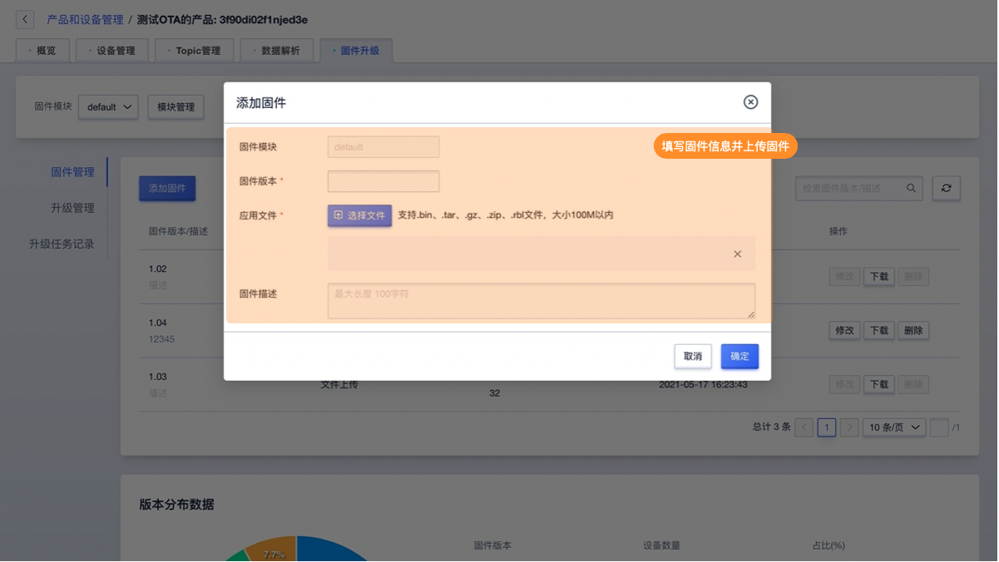

## 升级管理

升级管理为当前固件模块下所有设备的升级状态展示，并可对设备进行对应的升级操作，如创建升级任务，重试升级或取消升级。

**升级管理功能页面**

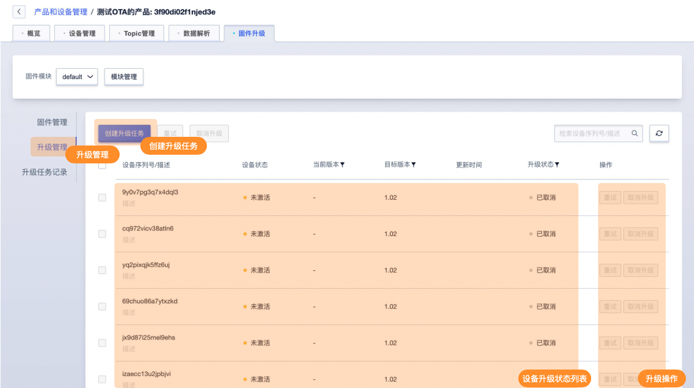

**创建升级任务**

创建升级任务，可对设备进行批量升级并产生升级任务记录。按照提示录入升级信息即可创建升级任务。

升级任务信息中

【目标版本】：为设备需升级的固件版本

【升级范围】：可选择按【固件版本】或【按设备列表】选择需升级的设备列表

【升级包推送速率】：为避免⼤量设备同时升级对系统资源⼤量消耗, 需设置平台推送升级信息的速率

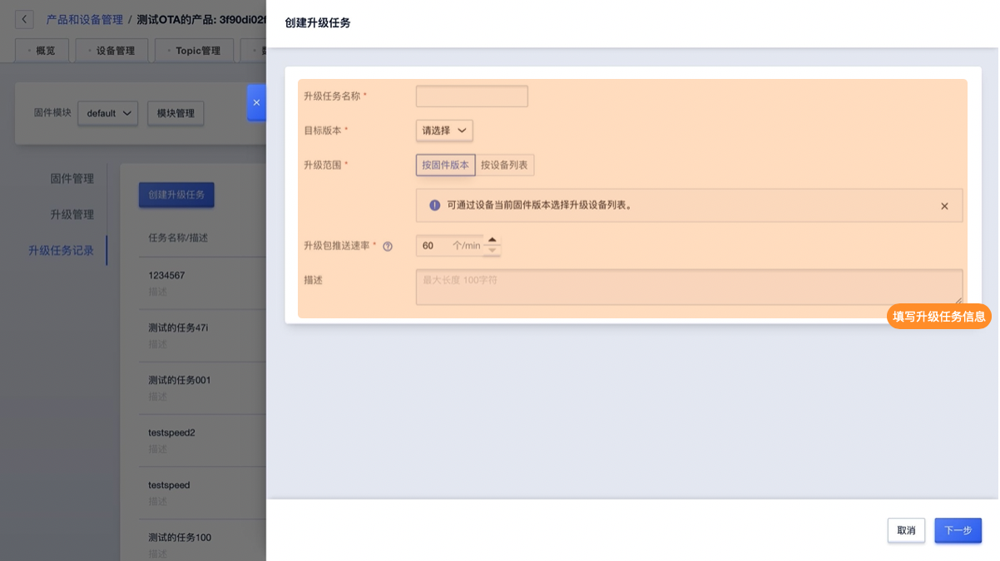

**创建升级任务-按固件版本升级**

可通过设备当前固件版本选择升级设备列表。

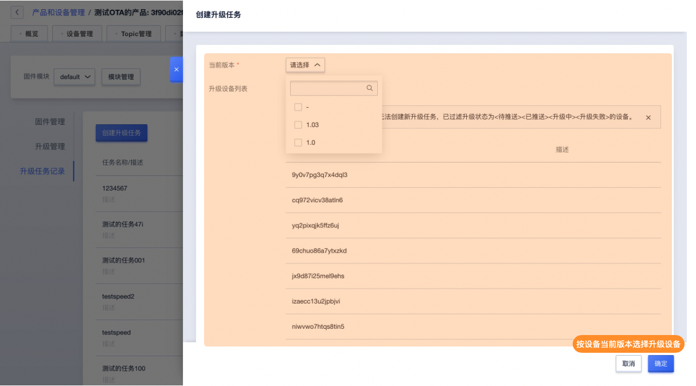

**创建升级任务-按设备列表升级**

可⾃定义选择升级设备列表。自定义选择设备列表一次最多升级500个设备。

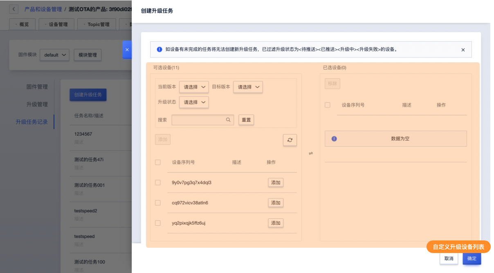

## 升级任务记录

创建升级任务后，可在升级任务记录中查看任务详情。详情中的设备升级列表可进行相应操作。

**升级任务记录功能页面**

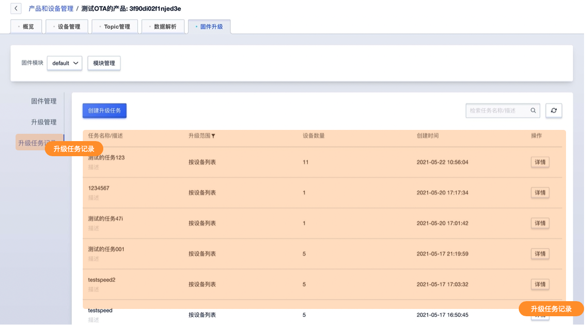

