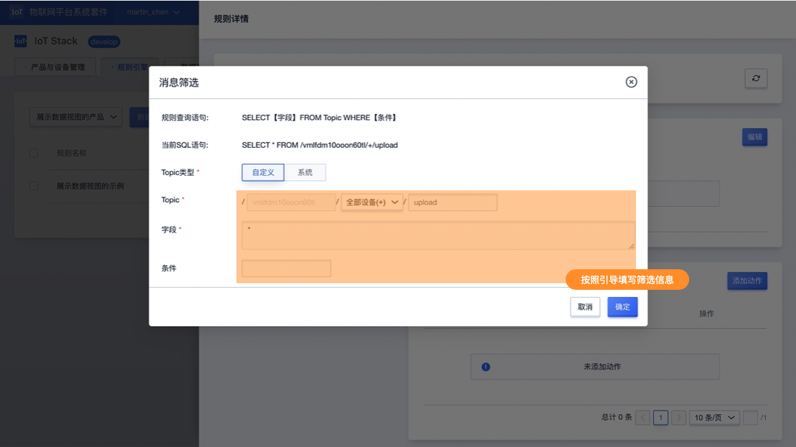

# 数据视图

IoT平台提供基于设备上报的数据，在控制台查看已经上报数据的视图展示功能。使用数据视图功能时，需先定义视图需要展示的数据格式，设备通过定义的数据格式上报数据。平台可将上报的数据存储IoT平台数据库供用户查询展示。

## 一、数据视图使用说明

### 1、使用流程

数据视图使用时需按照以下步骤进行操作：

* 创建数据视图，按照所需展示的数据定义设备上报的数据格式。定义数据格式后，IoT平台会提供数据格式模版，同时会在规则引擎的转发目的地增加该数据视图服务

* 设备按照定义的格式上报数据

* 通过规则引擎将设备上报的数据转发到数据视图服务

完成以上操作后，即可在数据视图功能中按照设备维度查看上报数据的视图

**流程图如下**

### 2、相关使用限制

* 数据视图为产品级功能，创建视图与具体产品关联。视图创建后，仅可当前产品下设备上报的数据转发到规则引擎视图服务中
* 同一产品可创建多个数据视图，创建上限为10个
* 设备上报的数据通过规则引擎转发到视图服务后会存入IoT平台的数据库，存储时间为90天
* 数据展示为设备维度，仅按照时间顺序展示单个设备上报的数据，暂不支持多个设备上报的数据同时展示
* 支持上报的数据类型及限制如下：
  * int32（整数型）、float32（单精度浮点型）、float64（双精度浮点型）
  * bool（布尔型）
  * enum（枚举型），支持10组枚举项
  * string（字符串），最大长度为2048
  * dateTime（时间型）String类型的UTC时间戳（毫秒）

* 单数据视图可定义/展示30个数据项目

  

### 3、数据上报时间说明

数据上报时间是指数据存入数据库时需记录的时间，作为展示历史数据视图的时间线索依据。可使用两种方式记录。

**使用规则引擎触发的时间**

设备上报数据时无需上报时间，或在规则引擎数据筛选时不需要筛选上报时间。规则引擎会使用该条规则（设备上报数据）触发的时间作为上报时间。

**变量时间**

以设备上报的dataTime类型数据项作为上报时间，需在规则引擎中筛选出此字段并指定为变量时间（变量时间格式为${变量}，“变量”替换为数据项的标识符）。上报时间戳需按照精确到毫秒。如为精确到毫秒，数据视图服务会自动补齐精确到毫秒。

##  二、控制台操作指南

### 1、数据视图功能概览

#### 功能入口

进入控制台首页，在一级导航即可看到数据视图功能。如下图

#### 功能说明

* 选择产品：选择具体产品下的 数据视图列表

* 创建视图：创建一个新的数据视图，具体操作流程参加本文后边相关章节

* 查看视图：查看已经创建的视图，即设备上报数据的视图展示
* 数据格式：获取当前视图的设备上报数据格式，或转发到规则引擎数据视图服务中需筛选的数据格式
* 删除数据视图：删除当前数据视图，删除后设备已经上报的数据将被删除

### 2、创建数据视图操作流程

#### 2.1操作流程

数据视图使用时需按照以下步骤进行操作：

* 创建数据视图，按照所需展示的数据定义设备上报的数据格式。定义数据格式后，IoT平台会提供数据格式模版，同时会在规则引擎的转发目的地增加该数据视图服务。

* 设备按照定义的格式上报数据。

* 通过规则引擎将设备上报的数据转发到数据视图服务。

完成以上操作后，即可在数据视图功能中按照设备维度查看上报数据的视图。

#### 2.2创建数据视图

1. 在数据视图页面点击创建数据视图，按照提示填写数据视图信息。
2. 按照操作指引进入数据视图编辑页面
3. 在数据视图编辑界面添加需要展示的数据项目
4. 完成数据项添加后，进入下一步获取数据格式，数据格式是在规则引擎筛选设备上报数据时使用的规范

控制台操作示例如下图：

**创建数据视图**

>
>
>按照提示录入数据视图信息

**编辑数据视图**
>
>
>
>在编辑数据视图中添加数据项
>
>
>
>按照提示添加数据项目内容
>
>可添加的数据类型及限制如下：
>
>* int32（整数型）、float32（单精度浮点型）、float64（双精度浮点型）
>* bool（布尔型）
>* enum（枚举型），支持10组枚举项
>* string（字符串），最大长度为2048
>* dateTime（时间型）String类型的UTC时间戳（毫秒）
>
>单数据视图可定义/展示30个数据项目

**获取数据格式**

>
>完成数据项目添加后可进入下一步获取数据格式
>
>
>
>数据格式是在规则引擎筛选设备数据时使用的规范，数据上报数据时需包含数据格式中的数据并符合对应的数据类型及格式

#### 2.3配置规则引擎

1. 在规则引擎功能界面选择数据视图对应的产品创建规则引擎
2. 在规则引擎数据筛选中选择设备上报数据使用的Topic，并按照数据格式筛选上报的数据
3. 在规则引擎动作中选择转发到数据视图服务并设置时间戳

控制台操作示例如下图：

**创建规则引擎**

> 
>
>在规则引擎界面选择数据视图对应的产品并创建规则引擎

**数据筛选**

> 
>
> * Topic类型选择自定义
> * Topic选择上报数据设备使用的Topic
> * 字段
>   * 如设备上报的数据与数据视图的数据格式相同，可直接写“*”
>   * 如设备上报的数据与数据视图的数据格式不相同，可通过SELECT语句将设备上报的数据转换成数据视图相同的数据格式

**规则引擎动作转发到数据视图**

> 
>
> * 选择动作选择转发到数据视图
> * 视图名称选择需要转发的数据视图
> * 时间戳，有两种使用方式
>   * 触发规则时间，规则引擎会使用该条规则（设备上报数据）触发的时间作为上报时间
>   * 变量时间，以设备上报的dataTime类型数据项作为上报时间，需在规则引擎中筛选出此字段并指定为变量时间（变量时间格式为${变量}，“变量”替换为数据项的标识符）。上报时间戳需按照精确到毫秒。如为精确到毫秒，数据视图服务会自动补齐精确到毫秒。

### 3、数据视图查看

配置完成数据视图后。设备上报的数据即可在数据视图中查看。在数据视图列表中查看对应的视图面板即可。

> 
> 
> 数据视图可以查看两种视图类型：当前数据、历史数据

#### 当前数据

当前数据为设备最新上报的数据展示，如下图示例

#### 历史数据

历史数据为当前设备上报的历史数据，如下图示例

>
>
>**数据展示说明：**
>
>* int32（整数型）、float32（单精度浮点型）、float64（双精度浮点型）类型数据会按照选择的时间范围展示数据变化曲线图
>* 其他类型数据仅展示选择时间范围内30条信息，更多数据可通过导出历史数据查看
>* 时间范围最大可选90天内的连续7天
