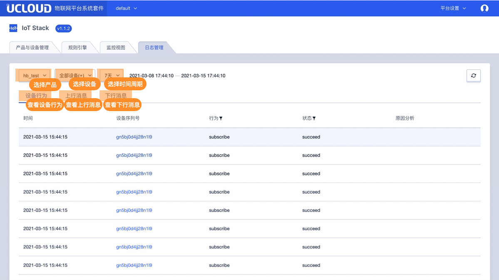
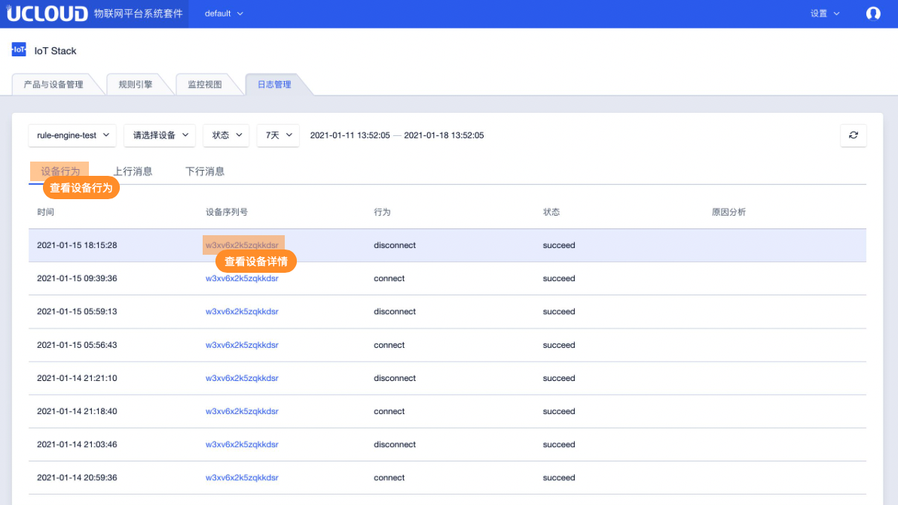
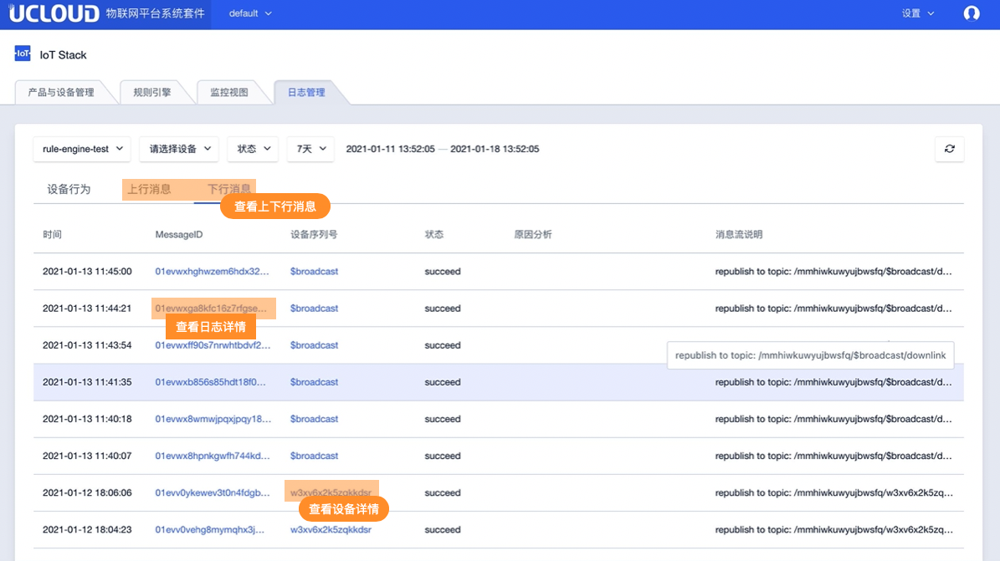
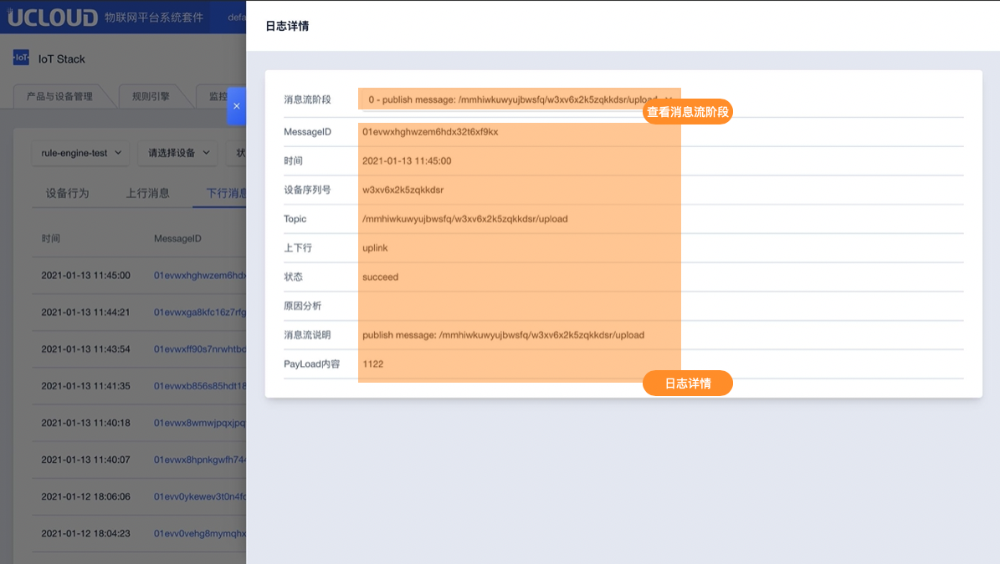
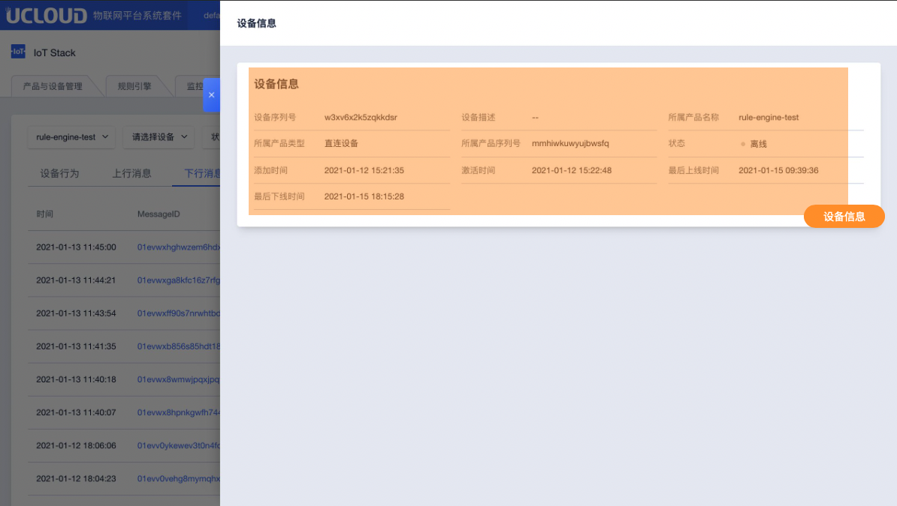

# 日志管理

IoT平台提供接入平台的设备日志查询和管理功能，可以方便的查询并了解设备的历史行为

## 一、日志管理功能介绍

日志管理功能包括设备行为日志、上行消息流日志、下行消息流日志。同时提供按照流转顺序展示的日志消息详情。

### 1、设备行为消息日志：

**日志包含字段：**

- 时间：消息发生的时间，
- 设备序列号：这条日志相关的设备，点击<${设备序列号}>可以查看该设备的详情
- 行为：包括设备上线、设备下线、设备订阅Topic、设备取消订阅Topic
- 状态：表示设备行为执行的最终状态，success/fail
- 原因分析：
  - 设备上线成功： - 
  - 设备上线失败：未授权
  - 设备下线：同clientid设备竞争/设备在控制台被删除/设备在控制台被禁用/设备主动发送disconnect请求
  - 设备订阅成功： - 
  - 设备订阅失败： 未授权
  - 设备取消订阅成功： - 

### 2、上行消息流日志

上行消息日志为设备发送消息到topic，消息流转到规则引擎和规则引擎转发消息到其他目的地的动作

**日志包含字段：**

- 时间：消息发生的时间
- MessageID： MessageID是某条消息在平台流转的唯一标识，通过Message ID可以查询设备在平台流转的路径，比如经过规则引擎；点击可以展开该条消息的流转过程
- 设备序列号：设备的序列号；点击<设备序列号>可以查看设备详情
- 状态：succeed/fail；
- 原因分析：
  - 设备发送消息到topic成功： - 
  - 设备发送消息到topic失败： 未授权
  - 消息流转到ruleengine成功： - 
  - 消息流转到ruleengine失败： 系统错误
  - 消息流转到kafka成功： - 
  - 消息流转到Kafka失败： Kafka服务异常/系统错误
  - 消息流转到MongoDB成功： - 
  - 消息流转到MongoDB失败：参数异常/Mongo服务异常/系统错误
  - 消息流转到TSDB成功： - 
  - 消息流转到TSDB失败： 参数异常/TSDB服务异常/系统错误
  - 消息流转到topic成功： - 
  - 消息流转到topic失败： 参数异常/系统异常
- 消息流说明：该消息具体的流转路径

### 3、下行消息流日志

下行消息日志为规则引擎转发消息到设备

**日志包含字段：**

- 时间：消息发生的时间
- MessageID： MessageID是某条消息在平台流转的唯一标识，通过Message ID可以查询设备在平台流转的路径，比如经过规则引擎；点击可以展开该条消息的流转过程
- 设备序列号：设备的序列号；点击<设备序列号>可以查看设备详情
- 状态：succeed/fail
- 原因分析：
  - 规则引擎转发消息到设备成功： - 
  - 规则引擎转发消息到设备失败： 设备离线/系统错误
- 消息流说明：该消息具体的流转路径

## 二、操作指南

### 1、进入日志管理

登录后在系统首页进入日志管理，日志管理主要功能布局如下：

**状态说明：**可筛选succeed或fail

**时间说明：**

* 可查看15分钟、1小时、1天、7天不同颗粒度的统计信息，也可以自定义，自定义最小窗口是15分钟，最大窗口是7天；

- 日志最长保存时间是90天；
- 日志上报周期为每10s上报一次

### 2、设备行为

设备行为如下图所示

### 3、上下行消息

上下行消息如下图所示

### 4、日志详情

日志详情如下图所示

### 5、设备详情

设备详情如下图所示

