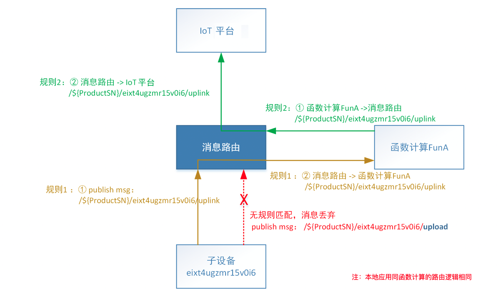
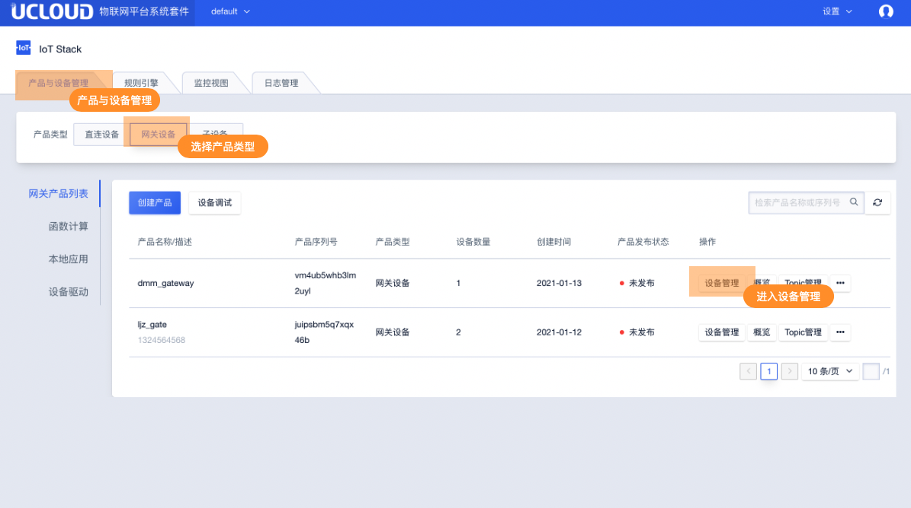
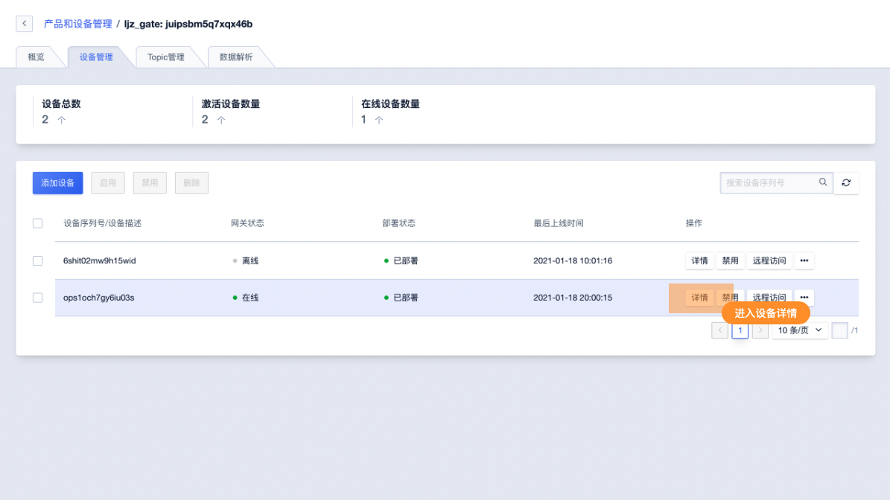
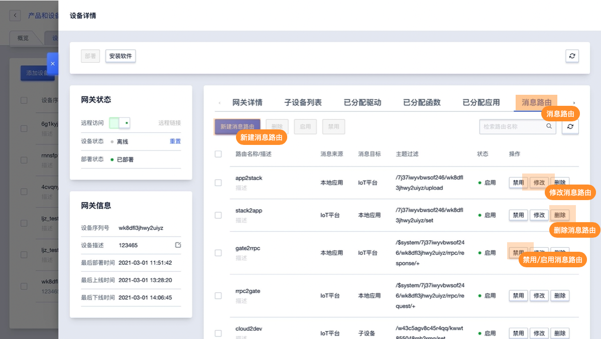

# 概览

消息路由使得通过Topic承载的消息可以在子设备、函数计算、本地应用、IoT云平台之间自由流转。消息路由是网关的核心功能之一。

消息路由的工作原理基于三要素：**消息源**， **过滤Topic**，**目的地**。

消息源：函数计算、本地应用、子设备、IoT平台；

目的地：函数计算、本地应用、子设备、IoT平台；

过滤Topic：只有匹配的Topic（来自源消息），才会转发到目的地；

#### 举例

假设配置下面两条消息路由，规则分别为：

| 编号  | 消息源                   | 过滤Topic                             | 目的地             |
| ----- | ------------------------ | ------------------------------------- | ------------------ |
| 规则1 | 子设备：eixt4ugzmr15v0i6 | /${ProductSN}/eixt4ugzmr15v0i6/uplink | 函数计算名称：FunA |
| 规则2 | 函数计算名称：FunA       | /${ProductSN}/eixt4ugzmr15v0i6/uplink | IoT平台         |

则可以通过下图查看消息的流转过程，所有消息都是通过消息路由流转：

## 二、操作指南

### 进入消息路由

在IoT平台首页进入产品与设备管理，选择网关产品类型，找到目标网关所在的产品进入设备管理。

在产品的设备列表中找到需要操作的网关。

消息路由页面主要功能如下：

