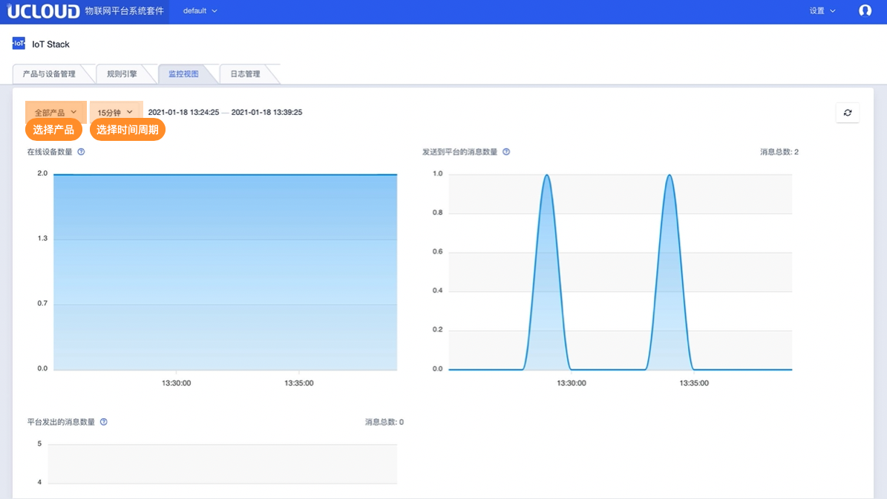

# 监控视图
监控视图包括3个方面的监控：
- 在线设备数量：是指与平台建立连接的数量，数据显示的是某个采样周期内的在线设备平均值；
- 发送到平台的消息数量：上行消息数，数据显示的是某个采样周期内的消息的累加值；
- 平台发出的消息数量：下行消息数，数据显示的是某个采样周期内的消息的累加值；

监控视图的说明：
- 监控视图可以查看全部产品或某个产品；
- 监控视图可以查看15分钟、1小时、1天、7天不同颗粒度的统计信息，也可以自定义，自定义最小窗口是15分钟，最大窗口是31天；
- 监控事件最长保存时间是90天；
- 监控数据上报周期为每60s一次

