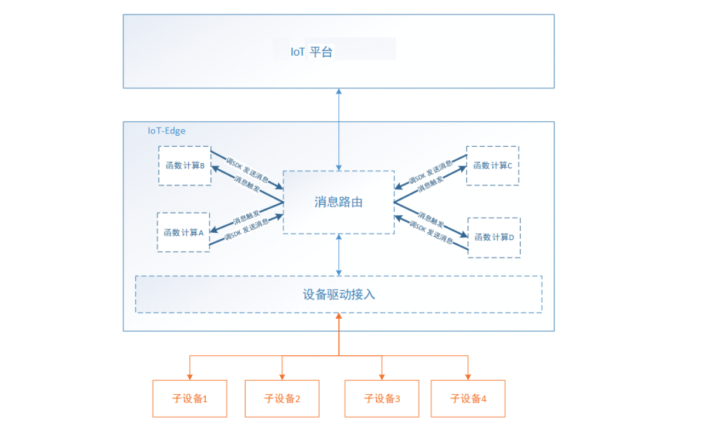

# 概览

边缘计算也叫函数计算（以下统一使用函数计算）可以帮助用户在边缘网关上运行自己的业务逻辑，比如进行数据解析、数据清洗、数据聚合、数据脱敏处理等。

函数计算可以实现：

- 低时延，本地实时处理，减少本地与云平台之间因为网络抖动造成的延时；

- 数据本地处理，避免大量无效、重复的数据上云；

- 本地解析，对于特殊格式的数据（如二进制解析为json格式），可先在本地解析后上传到云端；

函数计算的一些说明：

- 函数计算基于消息流触发，当函数计算收到消息路由发送的数据时，立刻触发函数运行；
- 函数计算也可基于cron表达式定时触发；
- 函数计算里发布消息，通过调用函数计算SDK的`sdk.publish()`接口实现；
- 函数计算支持访问redis；
- 函数计算支持http client数据发送；
- 函数计算目前支持Python3语言；

## 函数计算添加流程

1. 添加函数计算实现用户需要的数据处理到函数管理列表；
2. 分配函数计算到目标网关设备；
3. 配置消息路由设置目的地为函数计算，触发函数计算运行；
4. 重新部署，下发更新到边缘网关，进行测试运行，函数计算部署后运行框图如下图。

