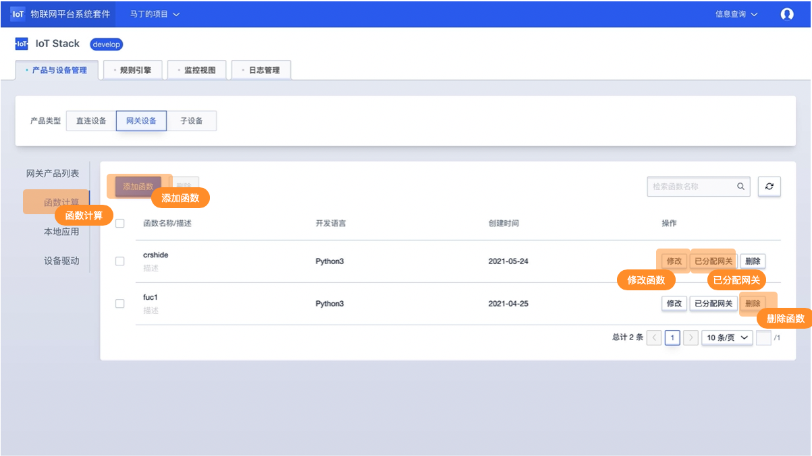
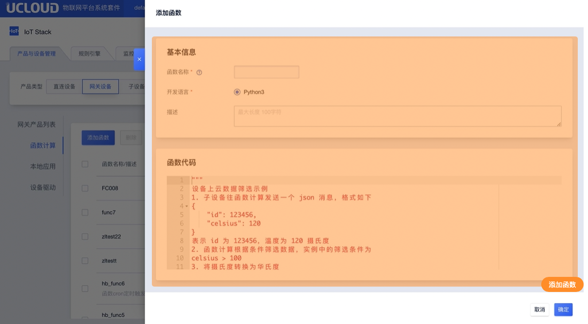
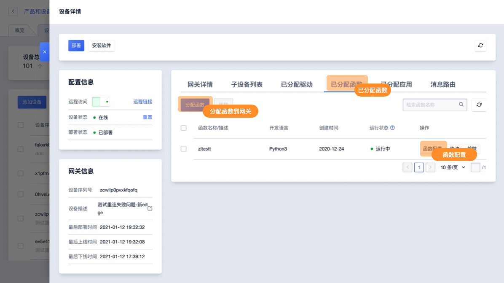
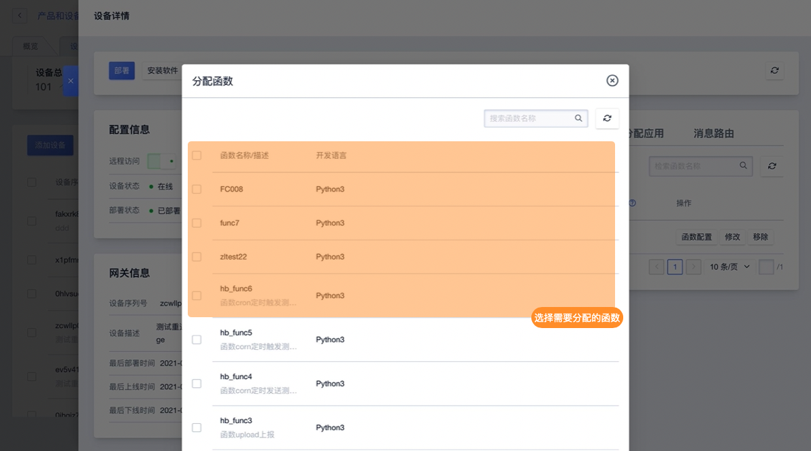
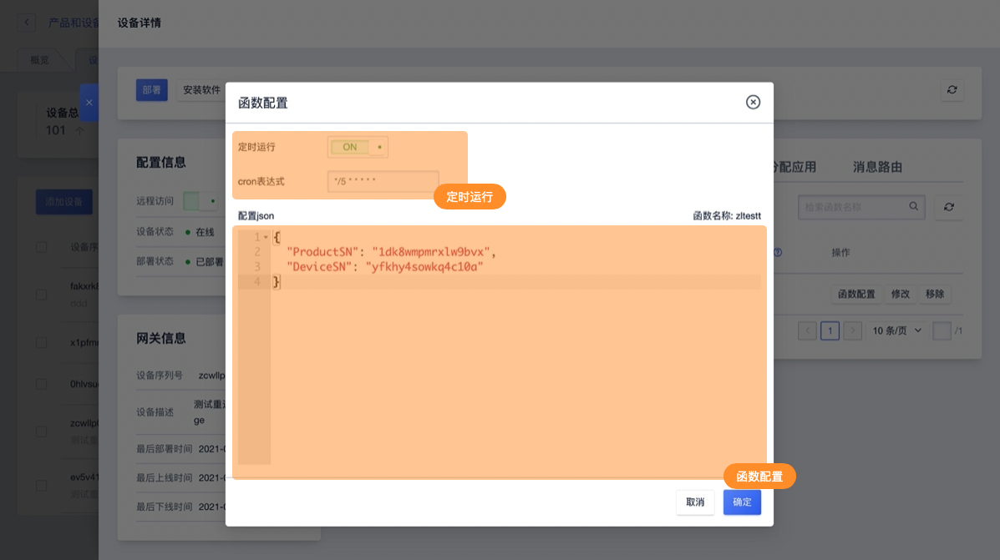

# 函数计算控制台操作指南

## 添加/删除/修改函数

### 添加函数
**1、进入目标网关设备详情，选择【函数计算】功能，点击【新增函数】**

**2、在函数计算编辑框内编写函数**

### 函数相关配置

函数相关配置可在创建函数时添加默认配置，默认配置会随应用分配到网关中。

* 默认配置为非必填，可直接在网关的应用相关配置中进行操作；
* 默认配置随网关分配后，依然可进行修改：
* 如网关已经进行配置信息的填写，默认配置不会随网关分配时修改已经填写的配置信息；

### 修改函数

**在函数列表中选择需要修改的函数，点击【修改】**
修改说明：修改函数会影响到已经分配到网关的函数，所以编写函数的时候尽量保持函数的通用性，针对具体网关的定制功能可以通过函数配置实现。

### 删除函数
**在函数列表中选择需要修改的函数，点击【删除】**
删除说明：如函数已经分配到网关设备中则无法删除

## 分配函数及网关相关设置

### 分配函数
**1、在【网关列表】找到需要使用的网关设备，点击【详情】在网关详情中找到【已分配函数】功能，点击【分配】**

**2、在函数列表中选择（可多选）需要分配到当前网关的函数，点击【确定】**

### 函数配置
**1、在【已分配函数列表】找到需要配置的函数，点击【函数配置】**

**2、在函数配置功能中进行函数配置**

函数配置说明：

1. 函数配置支持定时运行功能，需使用此功能开启后录入cron表达式即可
2. 函数配置需录入JSON格式的文件，请确认录入的格式正式

### 修改已分配函数
**在【已分配函数列表】找到需要修改的函数，点击【修改】**

修改说明：修改网关已分配的函数会影响到未分配的函数以及分配到其他网关的函数，所以编写函数的时候尽量保持函数的通用性，针对具体网关的定制功能可以通过函数配置实现。

### 其他说明
网关设备的分配函数或其他相关的函数修改，需部重新部署以下发到网关设备中方可生效。

