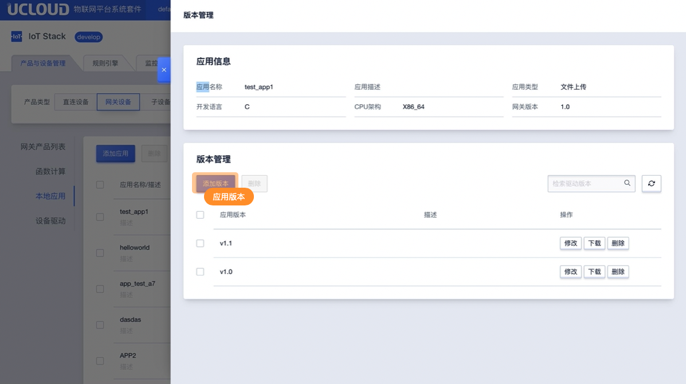
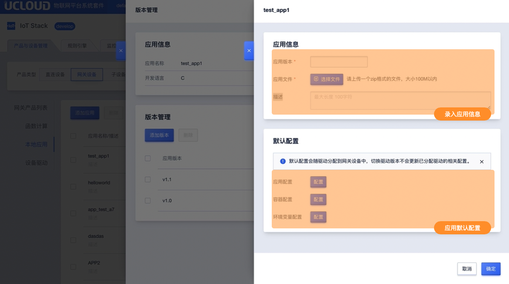
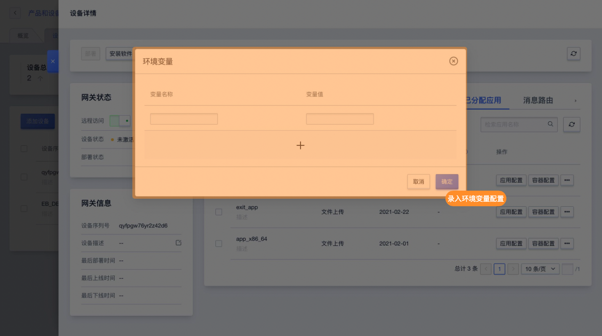
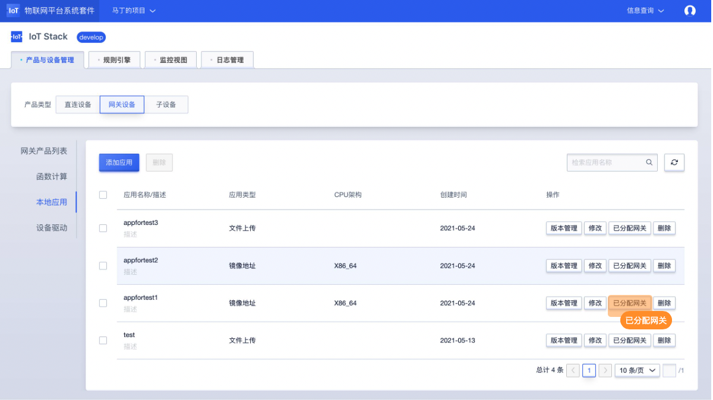
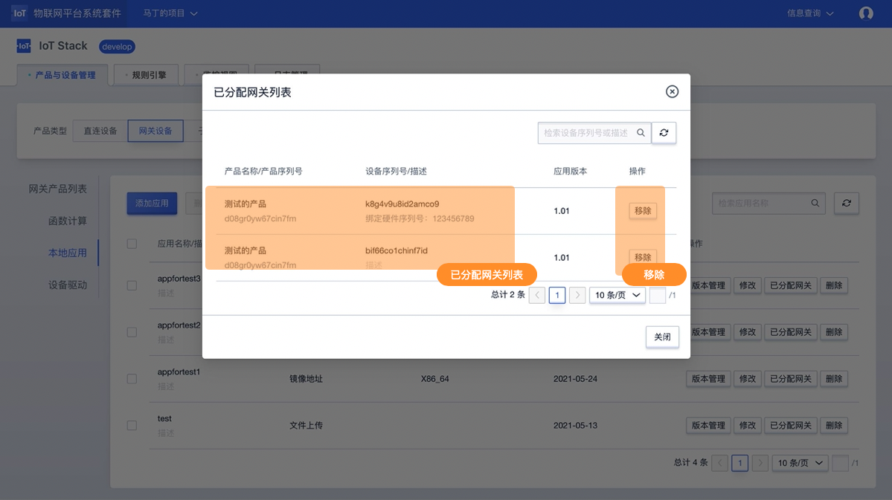

# 本地应用控制台操作指南

## 添加/删除/修改应用

### 添加应用
**1、进入目标网关设备详情，选择【本地应用】功能，点击【新增应用】**

**2、在本地应用编辑框内编写应用信息**

应用类型说明：本地应用支持文件上传、镜像地址两种类型

- 文件上传需录入信息
  - 开发语言：Python3、C
  - 适用软件版本：适用于IoT Edge的版本；
- 镜像地址需录入信息
  - 适用软件版本：适用于IoT Edge的版本；

**3、添加应用版本**

进入对应应用的版本管理，在版本管理列表中添加版本

* 应用版本：应用的版本
* 应用文件：当应用类型为文件上传，需上传文件。请上传一个zip格式的文件，大小100M以内
* 镜像地址：当应用类型为镜像地址，需填写镜像地址。
* 描述：当前应用版本的描述

### 应用相关配置

应用相关配置可在创建应用时添加默认配置，默认配置包括应用配置、容器配置、环境变量配置。默认配置会随应用分配到网关中。

* 默认配置为非必填，可直接在网关的应用相关配置中进行操作；
* 默认配置随网关分配后，依然可进行修改：
* 如网关已经进行配置信息的填写，默认配置不会随网关分配时修改已经填写的配置信息；

### 修改本地应用

**在应用列表中选择需要修改的应用，点击【修改】**
修改说明：修改应用会影响到已经分配到网关的应用，所以编写应用的时候尽量保持应用的通用性，针对具体网关的定制功能可以通过应用配置实现。

### 删除应用
**在应用列表中选择需要修改的应用，点击【删除】**
删除说明：如应用已经分配到网关设备中则无法删除

## 分配应用及网关相关设置

### 分配应用
**1、在【网关列表】找到需要使用的网关设备，点击【详情】在网关详情中找到【已分配应用】功能，点击【分配】**

**2、在应用列表中选择（可多选）需要分配到当前网关的应用，点击【确定】**

### 应用配置
**1、在【已分配应用列表】找到需要配置的应用，点击【应用配置】**
**2、在应用配置功能中进行配置**

应用配置说明：

应用配置需录入JSON格式的文件，请确认录入的格式正式

### 容器配置

**1、在【已分配应用列表】找到需要配置的应用，点击【容器配置】**

**2、在容器配置功能中进行配置**

### 环境变量配置

**1、在【已分配应用列表】找到需要配置的应用，点击【环境变量】**

**2、在环境变量配置功能中进行配置**

### 其他说明
网关设备的分配应用或其他相关的应用修改，需部重新部署以下发到网关设备中方可生效。

## 应用已分配网关

在应用管理页面可查询应用已分配的网关并可进行移除操作。

