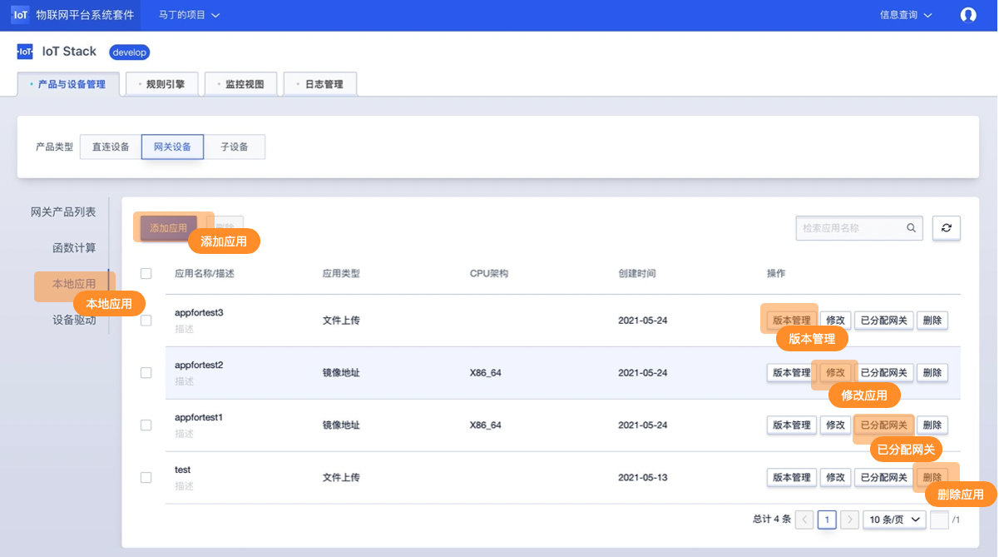
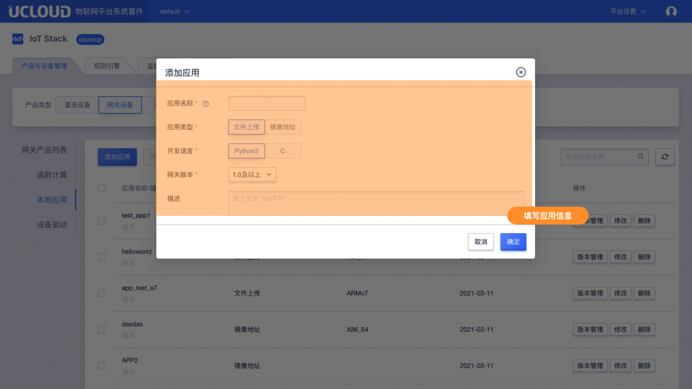
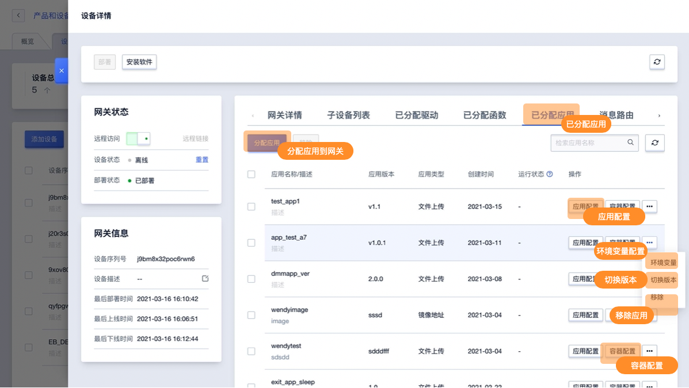
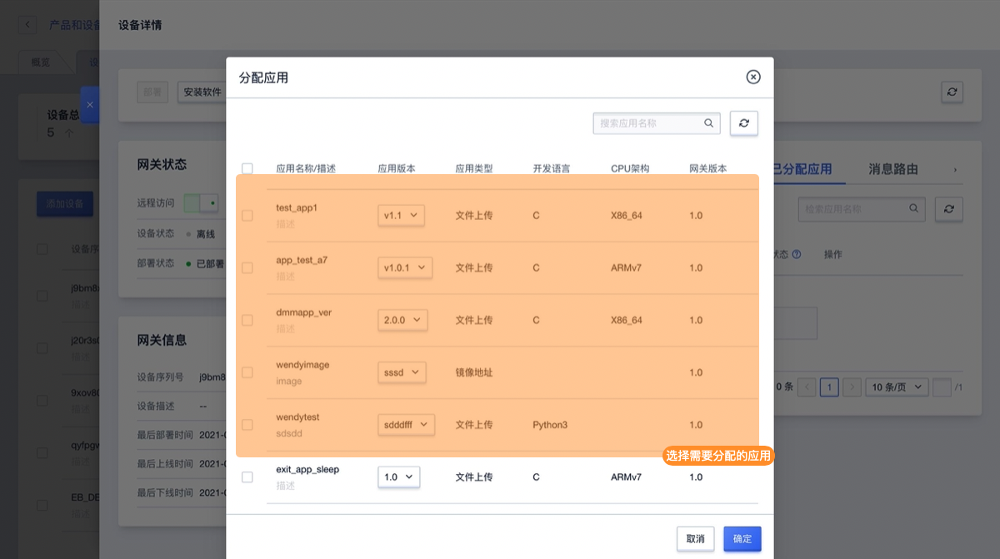

# 本地应用控制台操作指南

## 添加/删除/修改应用

### 添加应用
**1、进入目标网关设备详情，选择【本地应用】功能，点击【新增应用】**

**2、在本地应用编辑框内编写应用信息并上传附件**

应用类型说明：本地应用支持文件上传、镜像地址两种类型

- 文件上传需录入信息
  - 开发语言：Python3、C
  - 适用软件版本：适用于UIoT Edge的版本；
  - 应用文件：上传应用文件包；
- 镜像地址需录入信息
  - 适用软件版本：适用于UIoT Edge的版本；
  - 镜像地址：应用镜像所在的地址路径；

### 修改本地应用
**在应用列表中选择需要修改的应用，点击【修改】**
修改说明：修改应用会影响到已经分配到网关的应用，所以编写应用的时候尽量保持应用的通用性，针对具体网关的定制功能可以通过应用配置实现。

### 删除应用
**在应用列表中选择需要修改的应用，点击【删除】**
删除说明：如应用已经分配到网关设备中则无法删除

## 分配应用及网关相关设置

### 分配应用
**1、在【网关列表】找到需要使用的网关设备，点击【详情】在网关详情中找到【已分配应用】功能，点击【分配】**

**2、在应用列表中选择（可多选）需要分配到当前网关的应用，点击【确定】**

### 应用配置
**1、在【已分配应用列表】找到需要配置的应用，点击【应用配置】**
**2、在应用配置功能中进行配置**

应用配置说明：

应用配置需录入json格式的文件，请确认录入的格式正式

### 容器配置

**1、在【已分配应用列表】找到需要配置的应用，点击【容器配置】**

**2、在容器配置功能中进行配置**

### 修改已分配应用

**在【已分配应用列表】找到需要修改的应用【修改】**

修改说明：修改网关已分配的应用会影响到未分配的应用以及分配到其他网关的应用所以编写应用时候尽量保持函数的通用性，针对具体网关的定制功能可以通过应用配置实现。

### 其他说明
网关设备的分配应用或其他相关的应用修改，需部重新部署以下发到网关设备中方可生效。

