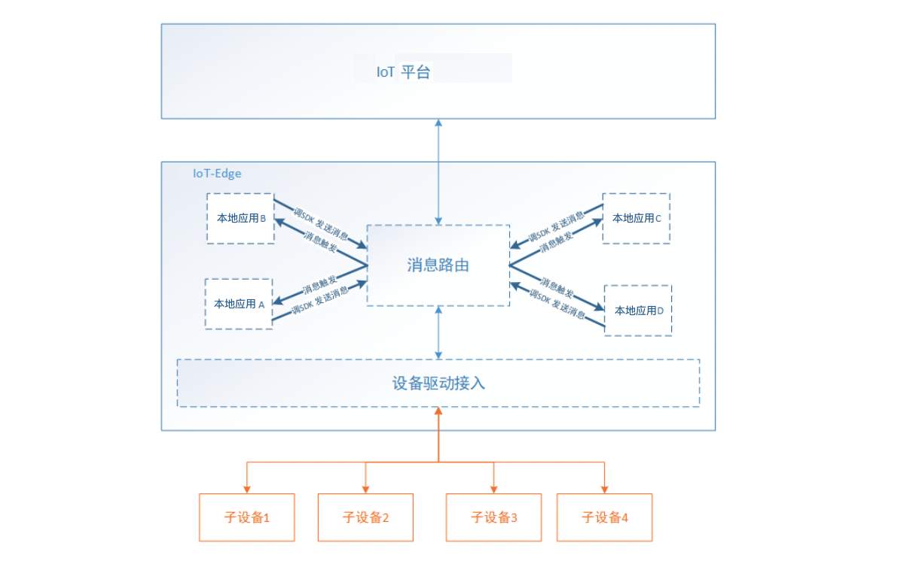

# 本地应用概览

本地应用是网关的核心功能，可以帮助用户在网关上运行自己的业务逻辑。

本地应用可以实现：

- 低时延，本地实时处理，减少本地与云平台之间因为网络抖动造成的延时；

- 数据本地处理，避免大量无效、重复的数据上云；

- 本地解析，对于特殊格式的数据（如二进制解析为json格式），可先在本地解析后上传到云端；

本地计算的一些说明：

- 本地应用基于消息流动触发，当函数计算收到消息路由发送的数据时，立刻触发应用运行；
- 本地应用里发布消息，通过调用函数计算SDK的`client.publish()`接口实现；
- 本地应用支持访问redis；
- 本地应用支持http client数据发送；
- 本地应用目前支持C、Python语言；

## 本地应用添加流程

1. 添加本地应用实现用户需要的数据处理到本地应用管理列表；
2. 分配本地应用到目标网关设备；
3. 配置消息路由设置目的地为本地应用，触发本地应用运行；
4. 重新部署，下发更新到边缘网关，进行测试运行，本地应用部署后运行框图如下图。

