# 控制台详细操作

**本地控制台操作遵循的原则：**

1. IoT平台修改的内容可以通过部署同步到本地网关；

2. 本地网关的修改只能在本地有效，IoT平台重新部署后会覆盖和本地有冲突的设备驱动、本地应用、函数计算、消息路由；

3. 如果本地添加的设备驱动、本地应用、函数计算同IoT平台部署的同名，在IoT平台部署时会被替换掉；

4. 本地控制台驱动绑定的子设备，需要手动输入`${ProdunctSN}/${DeviceSN}`，多条重复只生效一条；

5. 本地消息路由添加的本地Topic只能在本地流转；

6. 在IoT平台部署时可选择停用本地应用，如停用在本地部署时会恢复运行；

7. 本地控制台添加驱动、本地应用、函数计算需要本地<部署>后才能生效，添加消息路由会立即生效；

   

## 登录本地控制台

**登录本地控制台**
本地控制台访问地址：https://local-ip:19980 
默认登录账号：admin ，密码：在安装软件时设置，可在IoT平台的网关详情中查看。

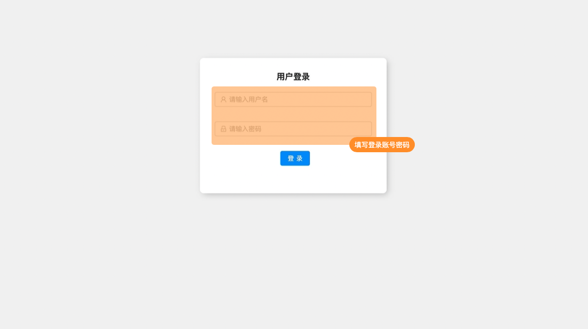

**本地控制台首页及功能入口**

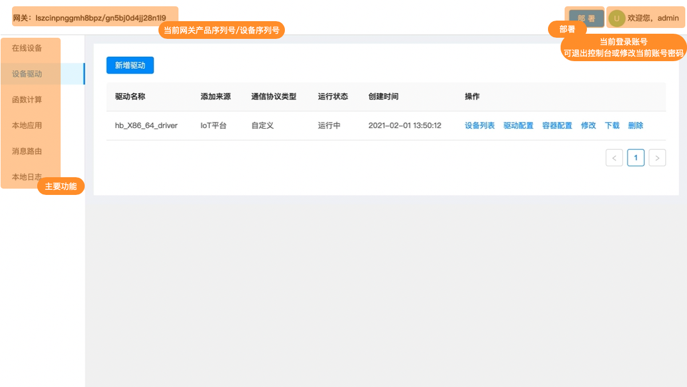

**修改登录密码**
进入本地控制台后点击右上角账号名称选择修改密码
在弹窗中录入原密码 并输入新密码进行修改

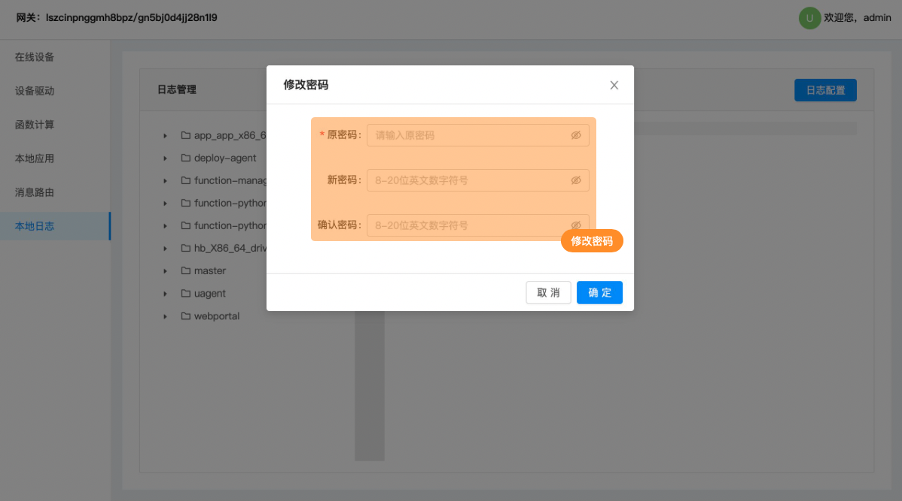

## 管理在线设备

登录本地控制台，切换到<在线设备>标签；

查看当前网关在线设备：
- 产品序列号：当前在线设备的产品序列号；
- 设备序列号：当前在线设备的设备序列号；
- 驱动名称：当前设备使用的驱动名称；
- 最后上线时间：当前设备最后上线时间；

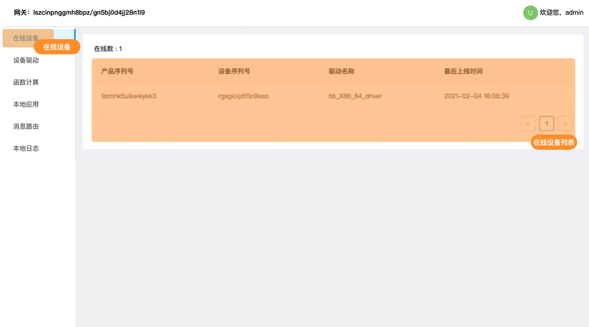

## 驱动管理

驱动管理可以查看IoT平台部署到网关的驱动，同时也可以在本地新增驱动。驱动的编写规范参考子设备驱动与接入。

### 1、驱动列表

驱动列表包括两类驱动：一类是本地新增的驱动；另一类是通过IoT平台部署的驱动；

**驱动列表信息：**

- 驱动基本信息：包括驱动名称、添加来源、通信协议类型、运行状态、创建时间；
- 操作：
  - 设备列表：修改IoT平台下发的设备配置信息，或新增本地设备；
  - 修改：修改驱动，包括驱动名称、适用软件版本、驱动描述、上传驱动；
  - 驱动配置：修改驱动配置文件；
  - 容器配置：修改针对当前驱动的容器配置；
  - 删除：删除该驱动；
- 下载：下载该驱动；
  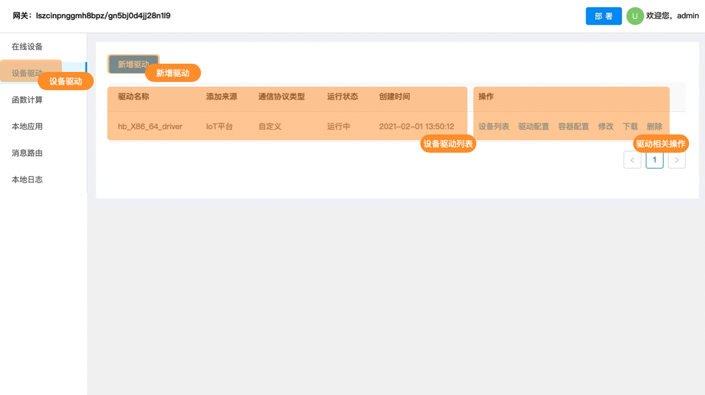

### 2、新增驱动

点击<新增驱动>，在弹出的新增驱动对话框中添加：

- 驱动名称：该驱动的名称；
- 驱动类型：自定义；
- 通信协议类型：Modbus、opc-ua、自定义；
- 开发语言：支持Python3和C；
- 适用软件版本：适用于IoT Edge的版本；
- 驱动描述：关于该驱动的描述；
- 驱动上传：上传驱动文件包；

点击<确定>，可以在驱动列表中查看新增的驱动；

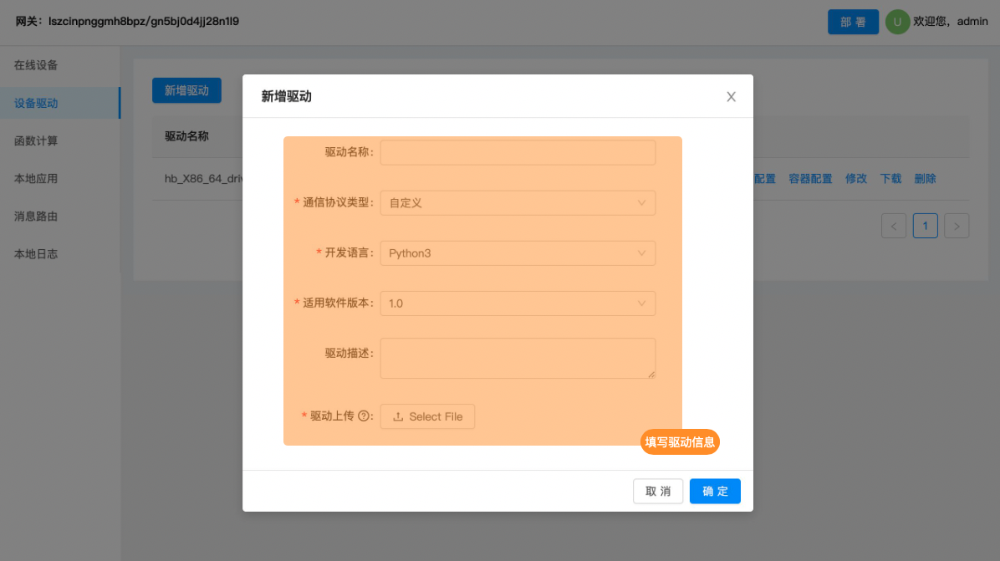

### 3、驱动操作-设备列表

设备列表：

- 子设备信息：包括产品序列号、设备序列号、绑定时间；
- 操作：

  - 配置：修改驱动针对该子设备的配置；

  - 移除：移除该子设备；
- 添加设备：绑定本地设备到驱动，设备产品序列号/序列号自行输入；

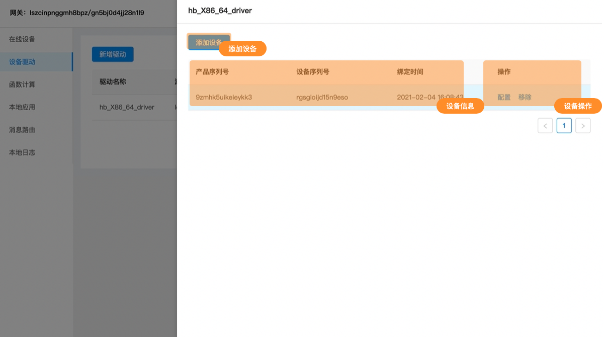

### 4、驱动操作-驱动配置

在驱动配置中使用JSON格式录入针对当前驱动的配置信息。

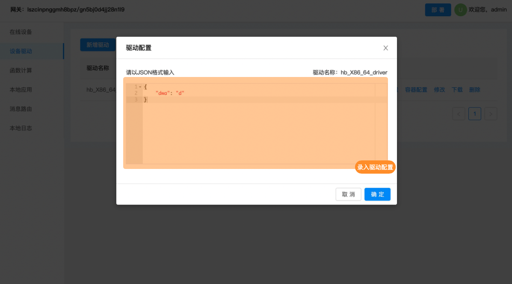

### 5、容器配置

在容器配置中录入针对当前驱动的容器配置。

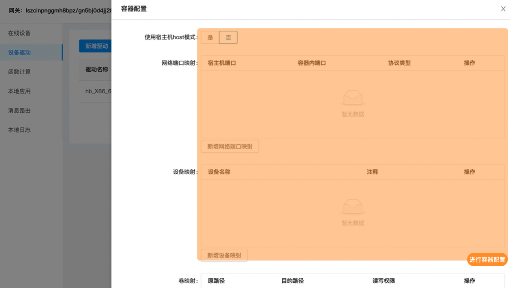

## 函数计算

函数计算可以查看IoT平台部署到网关的函数计算，同时也可以在本地新增函数。函数的编写规范参考函数开发及添加。

### 1、函数列表

函数列表包括两类：一类是本地新增的函数；另一类是通过IoT平台部署的函数；

查看**函数列表**：
- 函数基本信息：包括函数名称、添加来源、运行状态、创建时间；
- 操作：
  - 函数配置；
  - 修改：函数修改；
  - 删除：删除该函数计算；

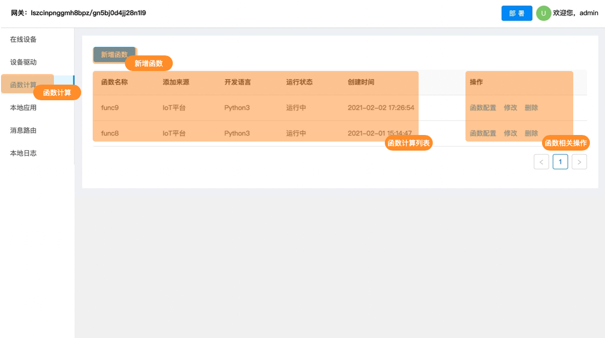

### 2、新增函数

点击<新增函数>，在弹出的新增函数对话框中添加：

- 函数名称：函数名称；
- 开发语言：支持Python3；
- 函数代码：直接输入相应的函数代码；
- 函数描述：关于该函数的描述；

点击<确定>，可以在函数计算列表中查看新增的函数；

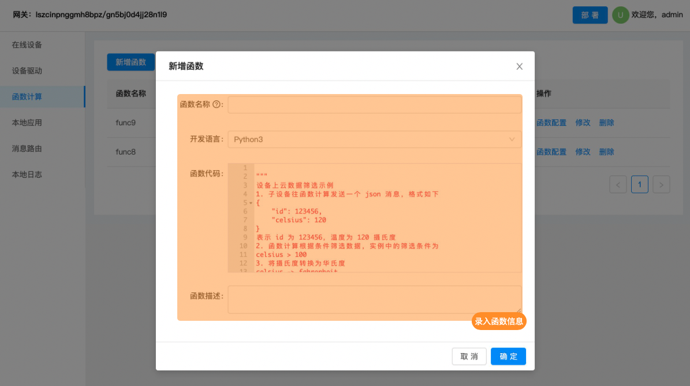

### 3、驱动操作-函数配置

在函数配置中使用JSON格式录入针对当前驱动的配置信息，如需使用定制运行开启此功能录入cron表达式即可。

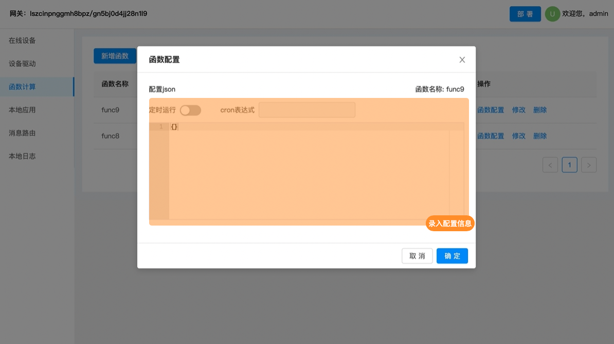

## 本地应用

本地应用可以查看IoT平台部署到网关的应用，同时也可以在本地新增应用。应用的编写规范参考本地应用。

### 1、应用列表

应用列表包括两类驱动：一类是本地新增的应用一类是通过IoT平台部署的应用；

**应用列表信息：**

- 应用基本信息：包括应用名称、添加来源、应用类型、运行状态、创建时间；
- 操作：
  - 应用配置：修改应用配置文件；
  - 容器配置：修改针对当前应用的容器配置；
  - 修改：修改应用的信息；
  - 删除：删除该应用；
  - 下载：如果应用类型为文件上传则可下载应用文件；
    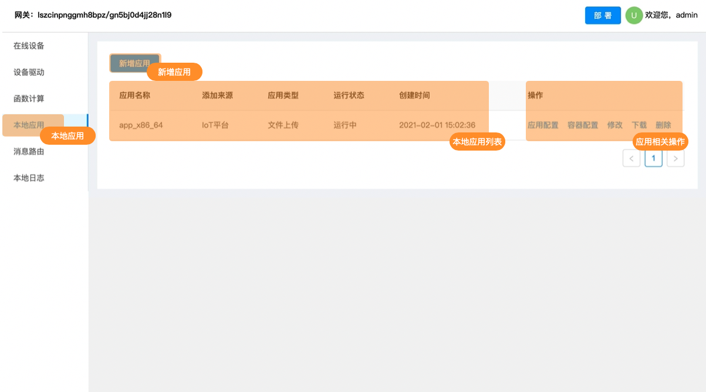

### 2、新增应用

点击<新增应用>，在弹出的新增驱动对话框中添加：

- 应用名称：该应用的名称；
- 应用类型：文件上传、镜像地址；
  - 文件上传
    - 开发语言：Python3、C
    - 适用软件版本：适用于IoT Edge的版本；
    - 应用文件：上传应用文件包；
  - 镜像地址
    - 适用软件版本：适用于IoT Edge的版本；
    - 镜像地址：应用镜像所在的地址路径；
- 应用描述：关于该应用的描述；

点击<确定>，可以在驱动列表中查看新增的应用；

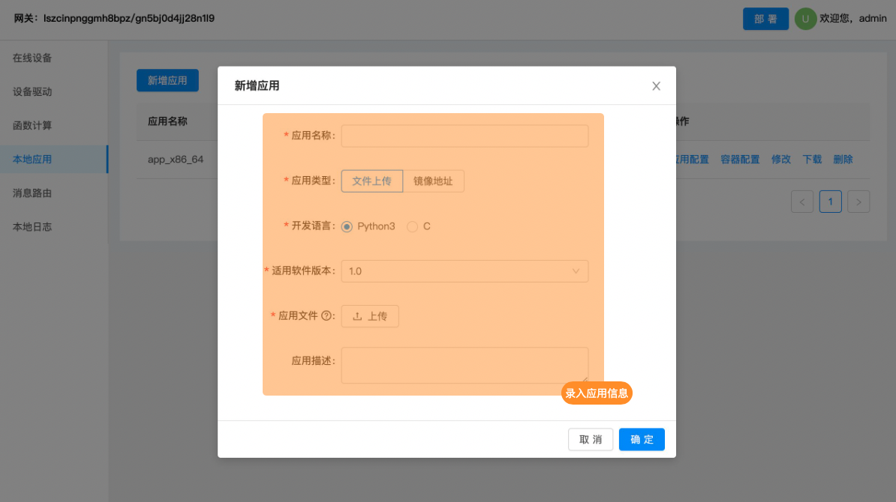

### 3、应用操作-应用配置

在应用配置中使用JSON格式录入针对当前应用的配置信息。

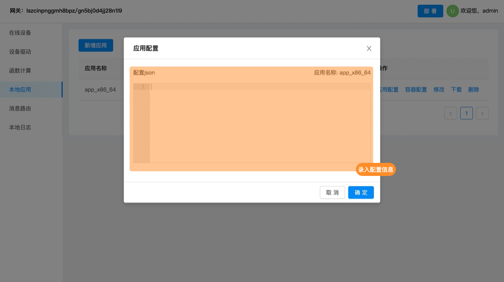

### 4、应用操作-容器配置

在容器配置中录入针对当前应用的容器配置。

## 消息路由

消息路由可以查看IoT部署到网关的消息路由规则，同时也可以在本地新增消息路由。消息路由的配置详解参考消息路由配置详解。消息路由本地添加成功后立即生效，无需重新部署；

### 1、消息路由列表

消息路由列表包括两类：一类是本地新增的函数；另一类是通过IoT平台部署的函数；

查看**消息路由列表**：
- 消息路由基本信息：包括消息路由名称、路由描述、消息来源、消息目标、消息过滤主题；
- 操作：
  - 修改：修改该条规则；
  - 删除：删除该条规则；

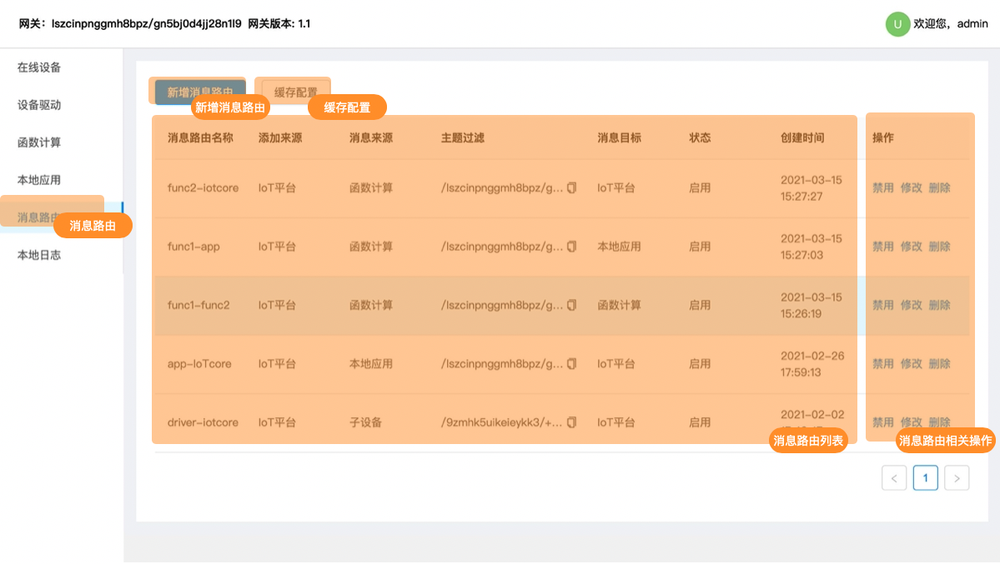

### 2、新增消息路由

点击<新增消息路由>，在弹出的新增消息路由对话框中添加：
- 消息路由名称：该消息路由的名称；
- 消息来源：选择本地设备、IoT平台、函数计算、本地应用；
- 消息过滤主题：填写消息过滤的主题。当消息来源或目标为IoT平台时，需要配置为云端的Topic，并且子设备已经绑定到了本网关下；
- 消息目标：选择本地设备、IoT平台、函数计算、本地应用；
- 消息路由描述：关于该消息路由的描述；

4. 点击<确定>，可以在消息路由列表中查看新增的消息路由；
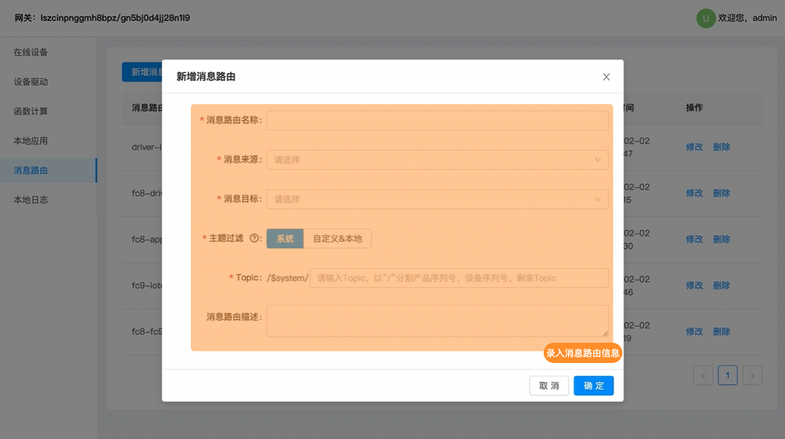

### 3、缓存配置
* 当消息目标为IoT平台时可开启缓存功能，开启离线缓存，若网关离线，消息将被缓存，待网关上线后发送消息到IoT平台（QoS质量为1）。
* 可在消息路由列表通过缓存配置进行相关设置。当缓存内容达到缓存时间和缓存消息数中的一项便触发。

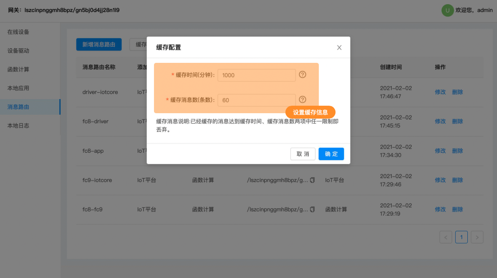

## 日志设置

本地控制台可以对网关的本地日志进行查看和设置。具体操作如下。

### 1、查看本地日志

切换到<本地日志>标签；

在日志目录中找到所需的日志文件，打开后可查看日志内容。

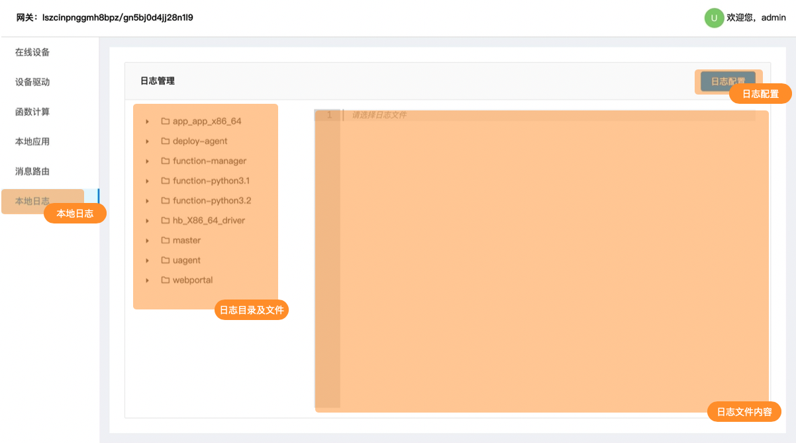

### 2、日志设置

点击右上角<日志配置>进行配置

**配置说明**

1. 日志级别：按级别由低到高分别为[info]、[debug]、[warn]、[error]四个级别，选择日志级别越低，日志记录信息越详细，占用日志空间越多，默认值为[info]。例：选择[warn]级别日志会记录级别不小于[warn]级别的日志，即[warn]、[error]两个级别的日志会记录。
2. 单服务日志数：可设置当个服务的日志记录文件数（默认值是5），每个日志文件为1MB。例：设置8个日志文件，单个服务最多纪录8个日志文件，超过8个文件后会替换最早的日志文件。

