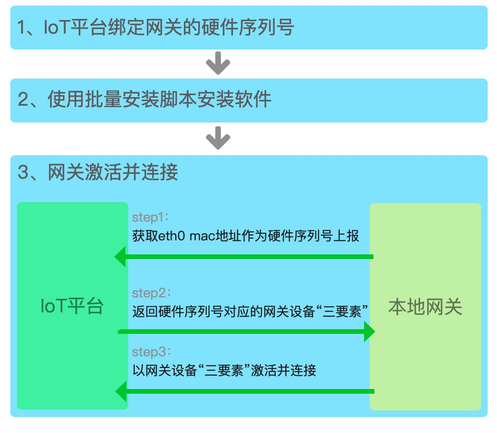
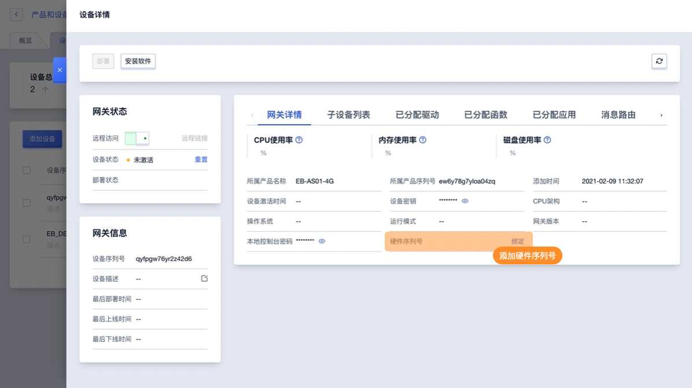
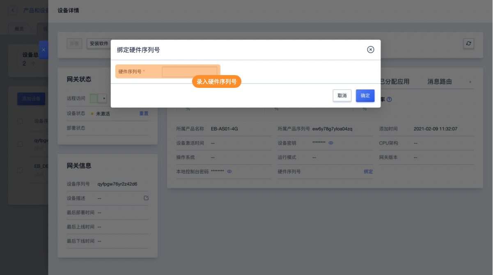
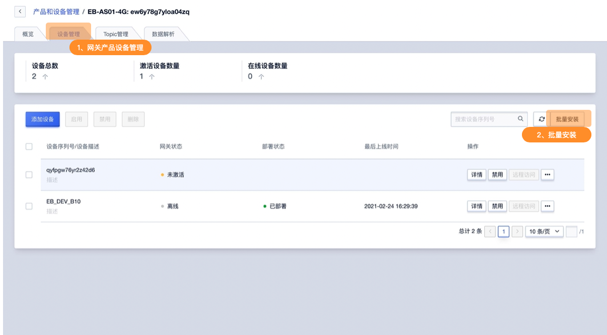
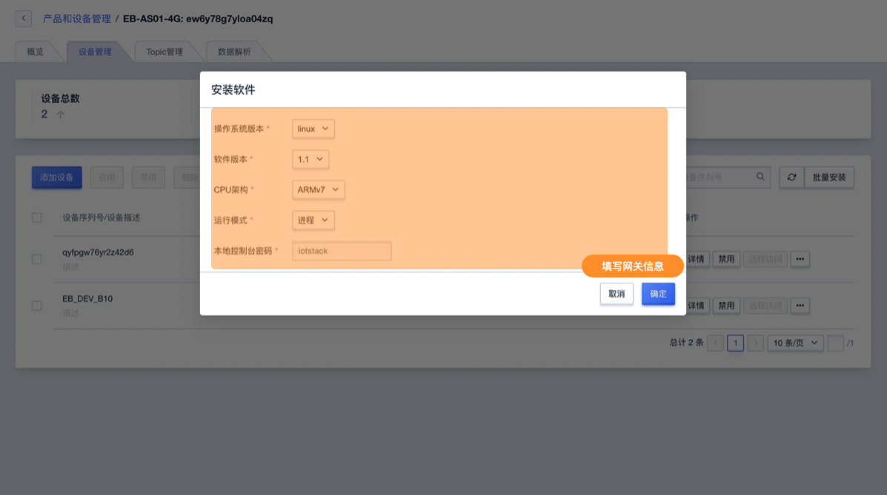
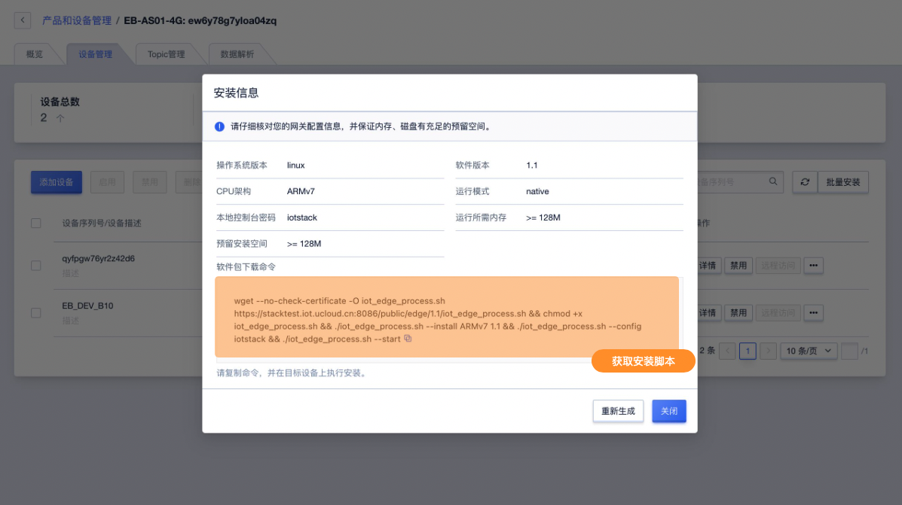
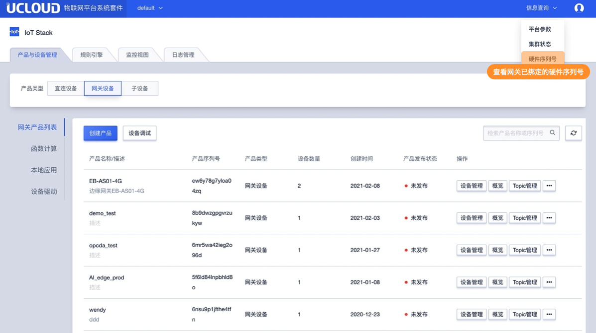
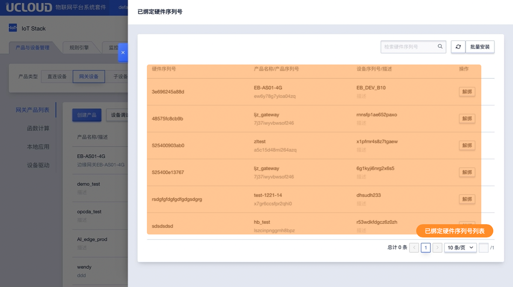
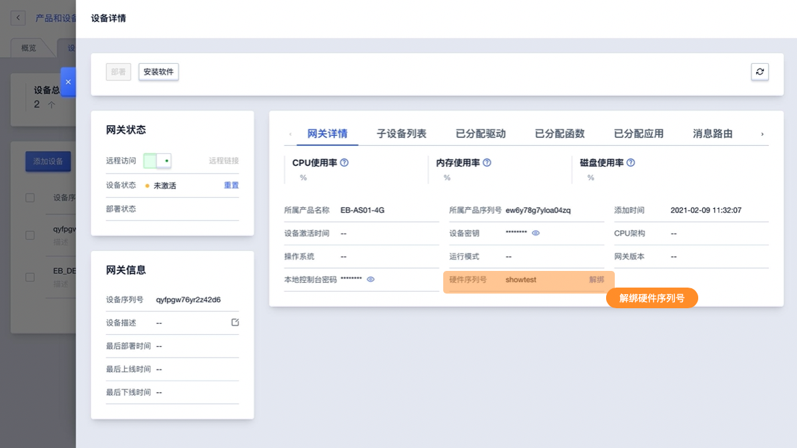

# 硬件序列号

为方便网关硬件批量出货，IoT Edge支持绑定硬件序列号功能。网关硬件安装统一的网关软件（相同的网关软件镜像），网关联网后可以上报自己的MAC地址作为硬件序列号从IoT平台获取网关“三要素”并连接IoT平台。

## 一、功能原理

**使用流程：**

1. IoT平台绑定网关的硬件序列号
2. 使用批量安装脚本安装软件
3. 网关激活并连接

**网关激活连接原理**

1. 网关获取eth0 MAC地址作为硬件序列号上报IoT平台
2. IoT平台返回硬件序列号对应的网关设备“三要素”
3. 网关以网关设备“三要素”激活并连接

## 操作指南

### 网关绑定硬件序列号

进入网关详情页面找到添加硬件序列号功能添加即可

### 安装网关软件

1. 进入网关产品设备列表中找到批量安装功能。注意，不是在网关详情中的安装软件功能。

2. 填写安装信息并获取安装脚本

   录入信息说明：

   * CPU架构：【必填】可选ARMv7、ARMv8_64、X86_64
   * 适用软件版本：【必填】
   * 操作系统版本：【必填】
   * 运行模式：【必填】
   * 本地控制台密码【必填】：8-20位字母数数字组合 默认为iotstack

3. 在目标网关中安装软件即可。系统会自动下载安装软件包，并启动IoT Edge运行。运行成功后可在控制台查看网关在线状态为 在线。

### 查询硬件序列号

在信息查询（admin账号为平台信息）中找到硬件序列号功能，即可查询已绑定硬件序列号的网关列表

**说明：** 硬件序列号列表只展示当前账号下拥有权限的项目中所有设备中绑定了硬件序列号的网关设备列表。

### 解绑硬件序列号

1. 在硬件已绑定硬件序列号的网关详情中可解绑
2. 在硬件序列号查询功能中可解绑

