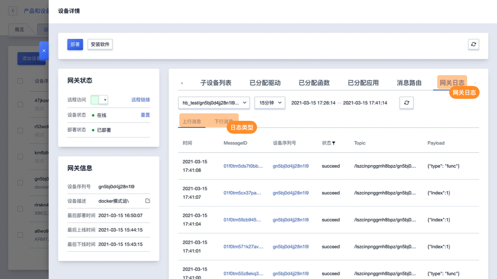

# 网关日志

网关设备提供网关日志功能，可查看当前网关的日志信息。

## 操作指南
在网关详情页面 进入网关日志界面，主要功能如下：

日志管理功能包括设备行为日志、上行消息流日志、下行消息流日志。同时提供按照流转顺序展示的日志消息详情。

### 上行（下行）消息流日志

上行（下行）消息日志为设备发送消息到topic，消息流转到规则引擎和规则引擎转发消息到其他目的地的动作

**日志包含字段：**

- 时间：消息发生的时间
- MessageID： MessageID是某条消息在平台流转的唯一标识，通过Message ID可以查询设备在平台流转的路径，比如经过规则引擎；点击可以展开该条消息的流转过程
- 设备序列号：设备的序列号；点击<设备序列号>可以查看设备详情
- 状态：succeed/fail；
- 原因分析：
  - 设备发送消息到topic成功： - 
  - 设备发送消息到topic失败： 未授权
  - 消息流转到ruleengine成功： - 
  - 消息流转到ruleengine失败： 系统错误
  - 消息流转到kafka成功： - 
  - 消息流转到Kafka失败： Kafka服务异常/系统错误
  - 消息流转到MongoDB成功： - 
  - 消息流转到MongoDB失败：参数异常/Mongo服务异常/系统错误
  - 消息流转到TSDB成功： - 
  - 消息流转到TSDB失败： 参数异常/TSDB服务异常/系统错误
  - 消息流转到topic成功： - 
  - 消息流转到topic失败： 参数异常/系统异常
- 消息流说明：该消息具体的流转路径