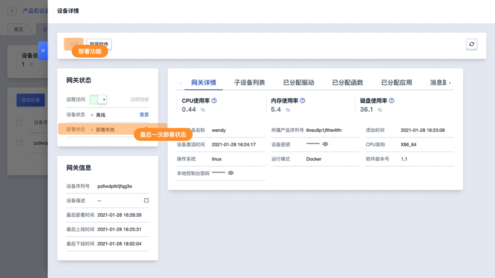
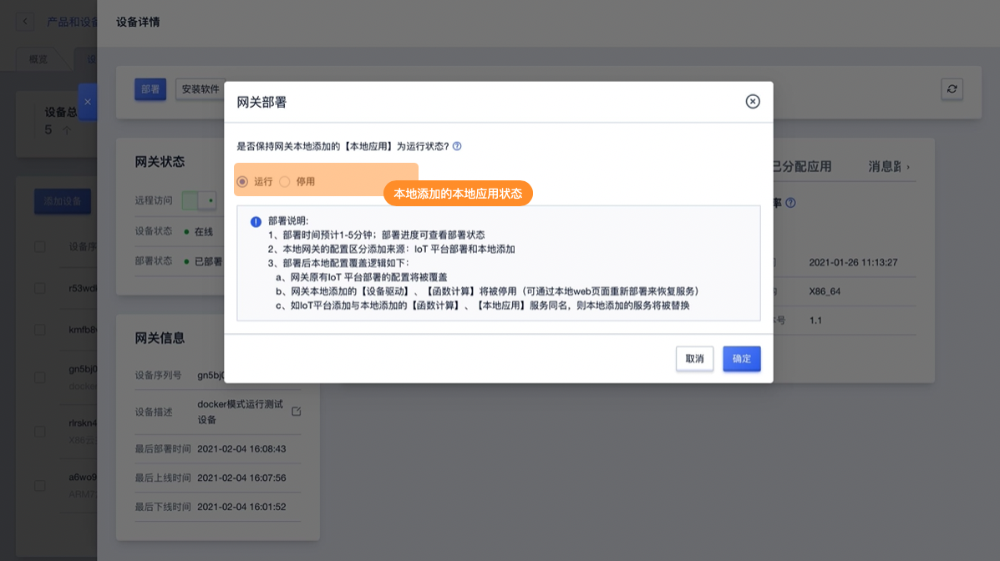
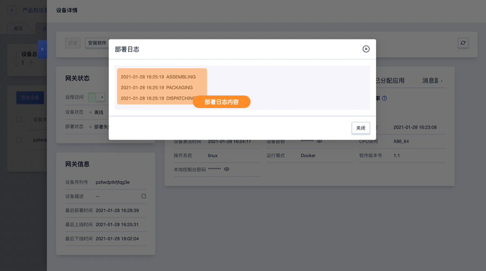

# 网关部署

在完成网关配置后，需通过部署功能将配置下发到边缘网关。部署时需网关在线方可操作。

## 操作指南

### 1、功能入口

进入网关详情后即可找到部署功能。

### 2、部署确认

**本地应用运行状态选择**

可设置是否保持网关本地添加的不同名【本地应用】为运行状态，【本地应用】停用后，可通过本地web页面重新部署来恢复服务。

**部署说明：**
1、部署时间预计1-5分钟；部署进度可查看部署状态
2、本地网关的配置区分添加来源：IoT 平台部署和本地添加
3、部署后本地配置覆盖逻辑如下：
     a、网关原有IoT 平台部署的配置将被覆盖
     b、网关本地添加的【设备驱动】、【函数计算】将被停用（可通过本地web页面重新部署来恢复服务）
     b、如IoT平台添加与本地添加的服务同名，则本地添加的服务将被替换

### 3、部署日志

当网关部署失败时可查看部署日志

