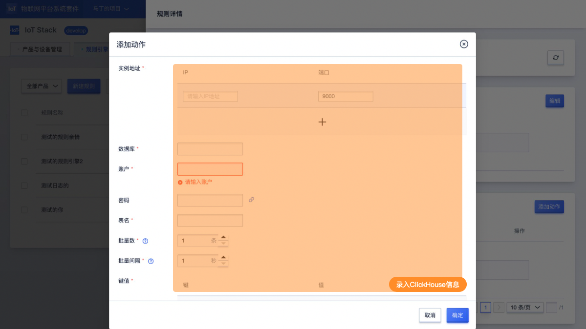

# 存储到ClickHouse

存储到ClickHouse仅支持JSON类型的规则引擎。

## 操作指南

在规则引擎规则详情页面中，点击<添加动作>后选择动作"存储到ClickHouse"

**录入信息说明**

- ClickHouse实例：填写实例IP及端口号（最多可录入三组IP及端口号）；
- 数据库：转存的ClickHouse数据库；
- 登录账户： ClickHouse的登录用户名;
- 登录密码：ClickHouse的登录密码（可为空）;
- 表名： 使用ClickHouse的哪个表；
- 批量数：一次批量插入的最大数量，范围1-10000（默认为1）；
- 批量间隔：一次批量插入的最大间隔范围1-60（默认为1）；
- 键值：键指的是表的字段名，值是消息筛选中的JSON数据键。比如需要流转的消息为：`{"a":1,"b":2}`，SQL筛选语句为：`SELECT * FROM /70ly1tvowt696r15/00:14:32:e1:72:f1/upload`，需要存储到MYSQL的数据库:表为`Database:Table1`，字段分别为`Column1,Column2`，则执行动作的键值可以写为：

| 键      | 值   |
| ------- | ---- |
| Column1 | ${a} |
| Column2 | ${b} |

**联通检测**
数据库信息填写完成后，可通过联通检测进行联通性校验。