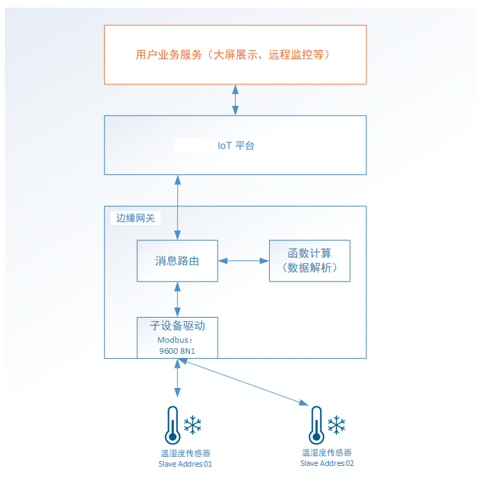
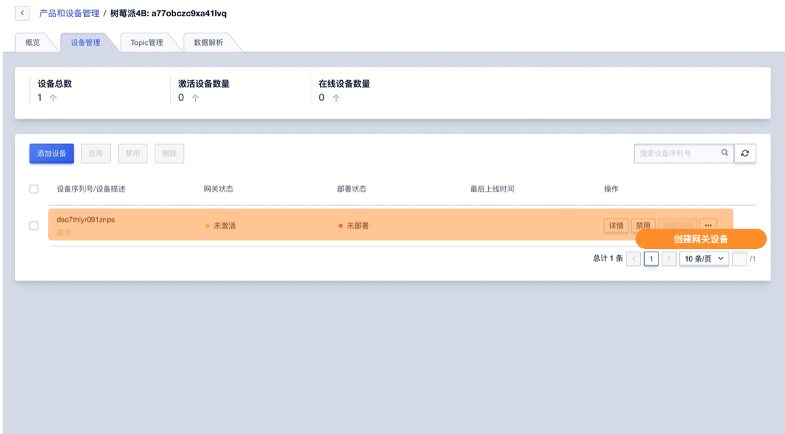
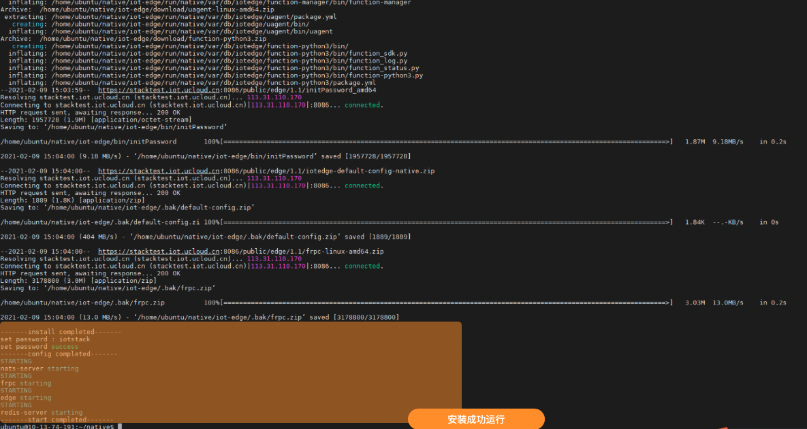
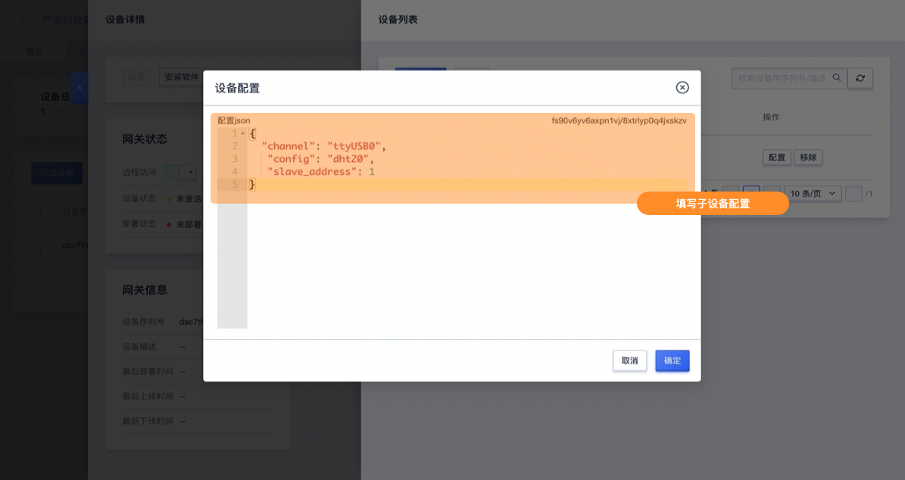
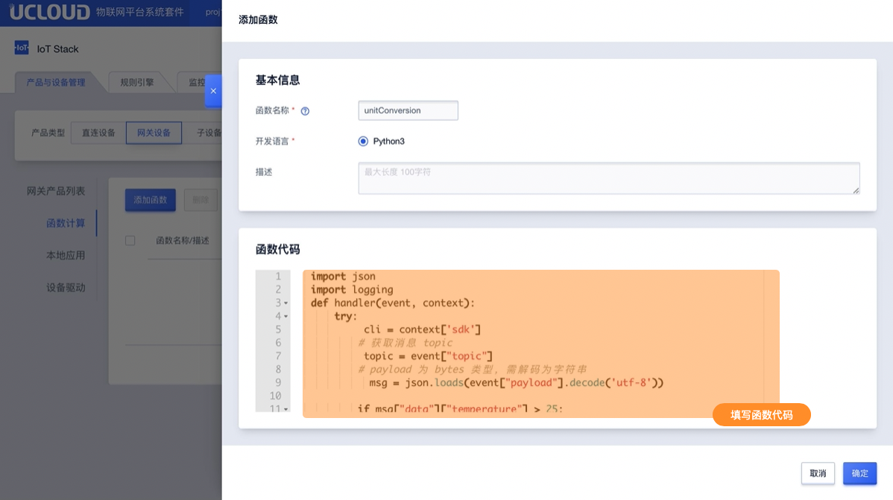
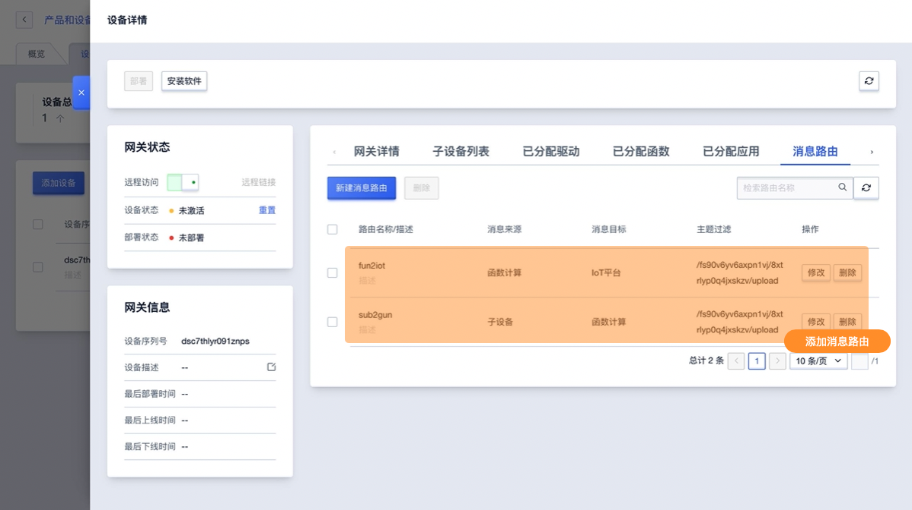

# 基于官方Modbus RTU驱动获取传感器温湿度

本节将以一个完整的例子详细介绍如何基于边缘网关，通过子设备驱动、函数计算、消息路由完成传感器温湿度的数据采集以及添加函数计算，并完成传感器数据上云。

本实践分为两个部分：

- 采集温湿度数据；
- 设置温湿度修正值；


## 系统架构




## 准备条件

1. 传感器设备：温湿度传感器SHT20，485接口 ，使用Modbus RTU
2. 网关设备：树莓派4B（ubuntu 64bit） + USB转485
3. 服务器：接收数据，下发数据
4. 边缘网关：使用IoT平台创建边缘网关产品，使用官方Modbus驱动


## 传感器相关参数

#### 1. 485连接参数：

   - 串口设备：/dev/ttyUSB0
   - 波特率： 9600
   - 8位数据，1位停止，无校验 

#### 2. 获取温湿度Modbus命令

**主机读取温度和湿度命令帧(0x04)** ：

| 从机地址 | 功能码 | 寄存器地址高字节 | 寄存器地址低字节 | 寄存器数量高字节 | 寄存器数量低字节 | CRC高字节 | CRC低字节 |
| -------- | ------ | ---------------- | ---------------- | ---------------- | ---------------- | --------- | --------- |
| 0x01     | 0x04   | 0x00             | 0x01             | 0x00             | 0x02             | 0x20      | 0x0B      |

   **从机响应数据帧：**

| 从机地址 | 功能码 | 字节数 | 温度高字节 | 温度低字节 | 湿度高字节 | 湿度低字节 | CRC高字节 | CRC低字节 |
| -------- | ------ | ------ | ---------- | ---------- | ---------- | ---------- | --------- | --------- |
| 0x01     | 0x04   | 0x04   | 0x01       | 0x31       | 0x02       | 0x22       | 0x2A      | 0xCE      |


   温度值=0x131,转换成十进制305，实际温度值= 305 / 10 = 30.5℃

   湿度值=0x222，转换成十进制546，实际湿度值=546 / 10 = 54.6%；


#### 3. 修改温湿度修正值

**修改温度修正值命令帧(0x06)** ：

| 从机地址 | 功能码 | 寄存器地址高字节 | 寄存器地址低字节 | 寄存器值高字节 | 寄存器值低字节 | CRC高字节 | CRC低字节 |
| -------- | ------ | ---------------- | ---------------- | -------------- | -------------- | --------- | --------- |
| 0x01     | 0x06   | 0x01             | 0x03             | 0x00           | 0x01           | 0xB9      | 0xF6      |

   **从机响应数据帧：**

| 从机地址 | 功能码 | 寄存器地址高字节 | 寄存器地址低字节 | 寄存器值高字节 | 寄存器值低字节 | CRC高字节 | CRC低字节 |
| -------- | ------ | ---------------- | ---------------- | -------------- | -------------- | --------- | --------- |
| 0x01     | 0x06   | 0x01             | 0x03             | 0x00           | 0x01           | 0xB9      | 0xF6      |

**修改湿度修正值命令帧(0x06)**：

| 从机地址 | 功能码 | 寄存器地址高字节 | 寄存器地址低字节 | 寄存器值高字节 | 寄存器值低字节 | CRC高字节 | CRC低字节 |
| -------- | ------ | ---------------- | ---------------- | -------------- | -------------- | --------- | --------- |
| 0x01     | 0x04   | 0x01             | 0x04             | 0x00           | 0x01           | 0x08      | 0x37      |

**从机响应数据帧：**

| 从机地址 | 功能码 | 寄存器地址高字节 | 寄存器地址低字节 | 寄存器值高字节 | 寄存器值低字节 | CRC高字节 | CRC低字节 |
| -------- | ------ | ---------------- | ---------------- | -------------- | -------------- | --------- | --------- |
| 0x01     | 0x04   | 0x01             | 0x04             | 0x00           | 0x01           | 0x08      | 0x37      |

**连续修改温度和湿度修正值命令帧(0x10)**：

| 从机地址 | 功能码 | 起始地址高字节 | 起始地址低字节 | 寄存器数量高字节 | 寄存器数量低字节 | 字节数 | 寄存器1值高字节 | 寄存器1值低字节 | 寄存器2值高字节 | 寄存器2值低字节 | CRC高字节 | CRC低字节 |
| -------- | ------ | -------------- | -------------- | ---------------- | ---------------- | ------ | --------------- | --------------- | --------------- | --------------- | --------- | --------- |
| 0x01     | 0x10   | 0x01           | 0x03           | 0x00             | 0x02             | 0x04   | 0x00            | 0x01            | 0x00            | 0x01            | 0x2E      | 0x2A      |

**从机响应数据帧：**

| 从机地址 | 功能码 | 寄存器地址高字节 | 寄存器地址低字节 | 寄存器数量高字节 | 寄存器数量低字节 | CRC高字节 | CRC低字节 |
| -------- | ------ | ---------------- | ---------------- | ---------------- | ---------------- | --------- | --------- |
| 0x01     | 0x10   | 0x01             | 0x03             | 0x00             | 0x02             | 0xB0      | 0x34      |

#### 4. 数据采集方式及上报格式

采集方式：轮询，间隔5s；

**温湿度上报格式：**

```json
{
	"data": {
		"temperature": 27.5,
		"humidity": 65
	}
}
```


**下发修正值payload：**

修改修正值支持两种方式：

1、依次修改温度修正值、湿度修正值

```json
{
	"data": {
		"temperature_fix": 1,
		"humidity_fix": -1
	}
}
```

2、同时修改温度修正值和湿度修正值

```json
{
	"data": {
		"temp_humi_fix": [1, -1]
	}
}
```

**上下行Topic**

```
上行Topic：
/${ProductSN}/${DeviceSN}/upload
```


## 操作步骤

**1、参考创建网关及子设备创建网关产品及设备，用于安装边缘网关软件**

- 创建网关产品：树莓派4B；创建网关设备：dsc7thlyr091znps；
- 创建子设备产品：SHT20；创建子设备设备：8xtrlyp0q4jxskzv；
- 将创建的子设备8xtrlyp0q4jxskzv绑定到网关设备dsc7thlyr091znps下；




**2、参考安装软件在树莓派上安装边缘网关软件**

选择需要安装的目录，运行安装脚本进行安装：

```bash
wget --no-check-certificate -O iot_edge_process.sh https://IP:8086/public/edge/1.1/iot_edge_process.sh && chmod +x iot_edge_process.sh && ./iot_edge_process.sh --install ARMv7 1.1 && ./iot_edge_process.sh --config productSN deviceSN deviceScrcet iotstack && ./iot_edge_process.sh --start
```
启动-停止边缘网关软件

```bash
     ./iot_edge_process.sh --start
     ./iot_edge_process.sh --stop
```

  




**3、分配官方驱动，并进行驱动配置、子设备绑定、子设备配置**

由于本实践基于官方modbus驱动，配置文件编写参考章节官方Modbus驱动。

**4、驱动配置**

- 配置action为读输入寄存器，分别以data.temperature，data.humidity的json字段格式上报；

- 配置action为写保持寄存器，写入data.temperature_fix，data.humidity_fix，data.temp_humi_fix下发的值；

```json
     {
     	"channel": {
     		"ttyUSB0": {
     			"port": "/dev/ttyUSB0",
     			"baudrate": 9600,
     			"method": "serial",
                 "format": "rtu",
     			"timeout": 1,
     			"period": 5,
     			"time_wait": 0.2
     		}
     	},
     	"dht20": {
     		"read": [{
     			"action": "04H",
     			"address": "0x0001",
     			"number": 2, //读取两个寄存器
     			"prop_list": [{
     					"name": "data.temperature",
     					"type": "int",
     					"count": 1, //返回的第一个寄存器值
     					"scale": 0.1,
     					"offset": 0
     				},
     				{
     					"name": "data.humidity",
     					"type": "int",
     					"count": 1, //返回的第二个寄存器值
     					"scale": 0.1,
     					"offset": 0
     				}
     			]
     		}],
     		"write": {
     			"data.temperature_fix": {
     				"action": "06H",
     				"address": "0x0103"
     			},
     			"data.humidity_fix": {
     				"action": "06H",
     				"address": "0x0104"
     			},
     			"data.temp_humi_fix": {
     				"action": "10H",
     				"address": "0x0103"
     			}
     		},
             "timestamp": true,
     		"topic": "/{}/{}/upload",
     		"mode": "cycle"
     	}
     }
```


- 子设备配置
  
  - 配置当前子设备使用的channel值；
         
     - 配置所属config类型；
     - 配置slave address；
     
```json
{
  "channel": "ttyUSB0",
   "config": "dht20",
   "slave_address": 1
}
```




5. 参考函数开发及添加编写函数计算，将payload中的temperature＞100摄氏度数据改成华氏度上报
  
	
```python
   
   """
   设备上报IoT平台数据筛选示例
   1. 根据驱动配置，函数计算收到子设备的json 消息，格式如下
   {
       "data":{
       	temperature": 26.5,
       	"humidity": 68
       }
   }
   2. 函数计算根据条件筛选数据，实例中的筛选条件为
   temperature > 25
   3. 将摄氏度转换为华氏度
   {
       "data":{
       	"temperature": 79.7,
       	"humidity": 68
       }
   }
   4. 注意，消息流转需要配置相应的消息路由
   """
   
   import json
   import logging
   
```
如果要使用 publish，需要先调用 EdgeClient 构造函数，初始化一个 client

 ```
   

   def handler(event, context):
       try:
       			cli = context['sdk']
           # 获取消息 topic
            topic = event["topic"]
           # payload 为 bytes 类型，需解码为字符串
             msg = json.loads(event["payload"].decode('utf-8'))

           if msg["data"]["temperature"] > 25:
               # 转换为华氏温标
               msg["data"]["temperature"] = msg["data"]["temperature"] * 1.8 + 32
               payload = json.dumps(msg).encode('utf-8')
               # 向指定 topic 发送消息
               cli.publish(topic, payload)
       
       except Exception:
           logging.exception(context)
 ```




6. 参考设置消息路由添加消息路由转发数据到云端

   - 路由一：子设备 -> 函数计算
   - 路由二：函数计算->IoT平台

   

7. 部署上述所有改动

   

以上配置完成后即可查看日志 


