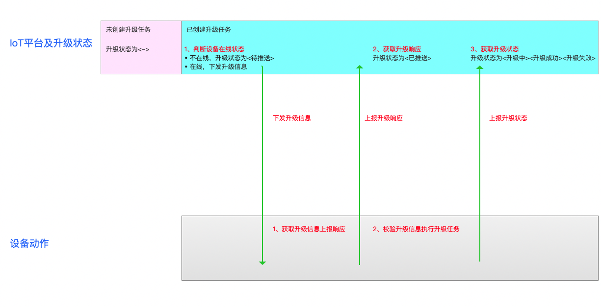

# 设备固件升级（OTA）


OTA（Over-the-Air Technology）即空中下载技术。在设备端开发中可以理解为固件升级技术。用户可以基于IoT平台的OTA技术直接进行OTA升级、应用配置远程更新下发等操作。


## 升级状态及升级流程说明

**升级状态**

创建升级任务后设备的升级状态如下

<->:设备未创建过升级任务

<待推送>：创建升级任务时设备不在线。设备在线后需上报当前版本，平台校验设备当前版本和升级任务的原版本一致后下发升级任务

<已推送>：已向设备推送升级任务信息并获取设备响应

<升级中>：设备上报升级中

<升级成功>：设备上报升级成功

<升级失败>：设备上报升级失败

<已取消>：平台取消升级任务

**升级流程**



**升级状态对应操作**

取消升级：当升级状态为<待推送><已推送><升级中><升级失败>时可取消任务
取消任务后：
1、待推送设备不再推送升级信息；已推送设备不做任何操作
2、设备升级状态改为<已取消>，如设备后续上报升级状态则按照最新状态更新


## 固件升级使用的Topic

固件升级的过程中涉及两个Topic：

|Topic | 权限|描述|
|---|---|---|
|/$system/${productSN}/${deviceSN}/ota/upstream|发布|设备上报固件版本及下载、升级状态|
|/$system/${productSN}/${deviceSN}/ota/downstream|订阅|设备接收IoT平台下发的固件升级消息|


## 操作指南

**设备上报版本号**
设备向`/$system/${productSN}/${deviceSN}/ota/upstream`发布一条消息进行版本上报，消息格式如下：

```
   {
    "Method": "report",
    "Payload": {
        "Version": "1.0",
        "Module": "module_a"
    }
}
```
    参数解释:
    - Method：消息类型为report_version
    - Module : 固件模块名称（固件模块为非default时必须添加，否则会被当成default上报处理；如上报的固件模块未在IoT平台添加则上报失败。）
    - Version：上报的版本号


**IoT平台下发固件升级消息给设备**
设备会通过订阅的`/$system/${productSN}/${deviceSN}/ota/downstream`收到固件升级的消息，内容如下：

```
	{
    "Method": "notify",
    "Payload": {
        "Version": "1.0",
        "CurrentVersion": "0.1",
        "Module": "module_a",
        "URL": "http://xxx/xxx.zip",
        "MD5": "aa30e838c7cdbbcbf8be7668aaeebee3",
        "Size": 1024,   // byte
        "TaskID": "1"
    }
}
```
	参数解释：
	- Method：消息类型为notify
	- Version：升级版本
	- CurrentVersion：需要升级设备的原始版本
	- Module : 固件模块名称
	- URL：下载固件的url，该URL会在1天后失效，不能下载
	- MD5：固件的MD5值
	- Size：固件大小，单位为字节
	- TaskID：升级任务ID

注：当创建升级任务时设备在线，IoT平台会直接下发升级消息给设备。当创建升级任务时设备离线，设备需在线后需向IoT平台上报当前版本，IoT平台会再次下发升级信息。


**设备上报升级响应**

设备向`/$system/${productSN}/${deviceSN}/ota/upstream`发布一条消息上报升级响应，消息格式如下：
```
{
    "Method": "notify",
    "Payload": {
        "TaskID": "1"
    }
}
```
    参数解释:
    - Method：消息类型为notify
    - TaskID：升级任务ID


**设备上报升级状态-升级中**

设备在收到固件升级的消息后，根据URL通过HTTP连接下载固件到设备并同时向`/$system/${productSN}/${deviceSN}/ota/upstream`发布一条消息上报升级进度，消息格式如下：

```
{
    "Method": "upgrading",
    "Payload": {
        "TaskID": "1"
    }
}
```

    参数解释:
    - Method：消息类型为upgrading
    - TaskID：升级任务ID


**设备上报升级状态-升级成功/失败**

设备向`/$system/${productSN}/${deviceSN}/ota/upstream`发布一条消息上报升级结果，消息格式如下：

```
{
    "Method": "success/fail", 
    "Payload": {
        "TaskID": "1",
        "ErrMsg": "firmware not exist"  
    }
}
```

    参数解释:
    - Method：消息类型为success或fail
    - TaskID：升级任务ID
    - ErrMsg：错误信息，可选字段


