# IoT Stack 集群部署操作示例

## 部署准备

部署IoT Stack 集群版需准备3台主机。主机配置配置为4核8G 20GB磁盘，操作系统为CentOS 7 64位。本文以UCloud云主机为例演示集群的部署流程。

三台云主机作为IoT Stack集群的三个服务节点，其中一个master两个node1、node2。


## 操作步骤

第一步，配置主节点的防火墙策略

第二步，安装NFS网络文件系统

第三步，安装Docker

第四步，部署K8S

第五步，安装IoT Stack系统


### 第一步、配置主节点防火墙策略

IoT Stack集群master需开启端口：80、1883、1888、7000、8080、8086、8088。

**UCloud主机开启端口操作指引**

>在UCloud云主机产品控制台开通三台主机并进入主机列表
>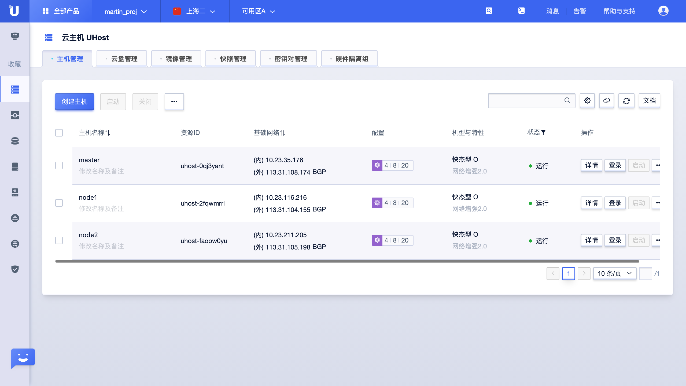
>
>在选定作为masterde 主机并在主机操作中找到更改外网防火墙功能
>
>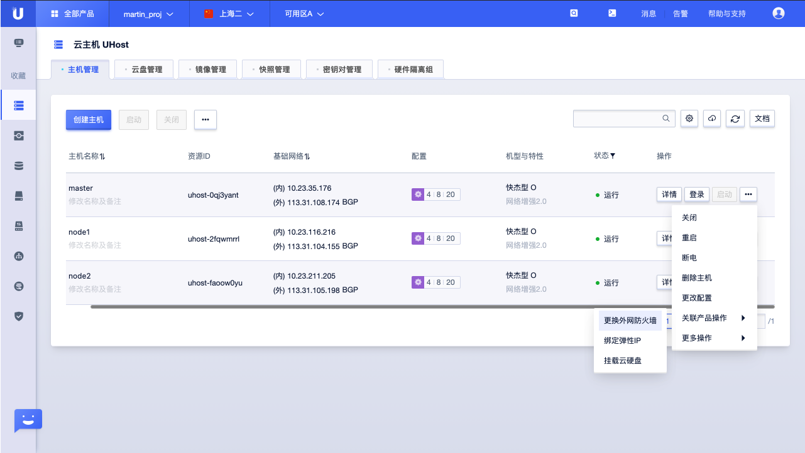
>按照控制台引导配置以下端口
>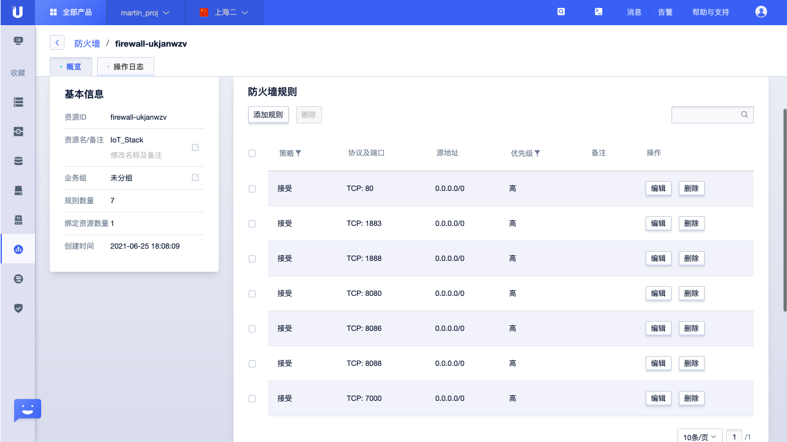

完成端口配置后，后续操作流程需SSH登陆到主机进行操作。


### 第二步、安装NFS网络文件系统

#### 1、在数据储存node中安装NFS网络文件系统

**1.1 创建数据持久化目录**

>登陆主机后 执行以下命令
>```
>mkdir -p /data/nfs
>```

**1.2 安装NFS**

> 完成上述步骤后执行以下命令
> ```
>yum install -y nfs-utils rpcbind
>```
> 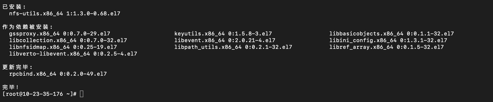


#### 2 、在master搭建NFS Server

**2.1 配置exports文件**

> 在exports文件中插入以下配置 
>```
>/data/nfs/ *(rw,sync,no_root_squash)
>```
>
>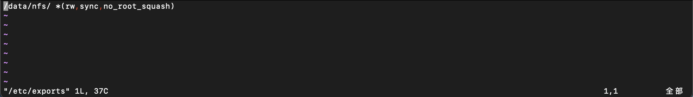

**2.2 设置开机启动**

> 执行以下命令
>
> ```
> systemctl enable rpcbind.service 
> systemctl enable nfs-server.service
> ```
>
> 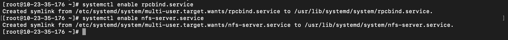

**2.3 启动NFS Server**
>执行以下命令
>```
>systemctl start rpcbind.service
>systemctl start nfs-server.service
>```
>
>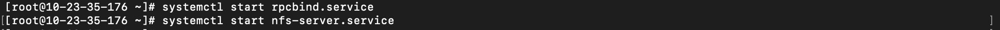
>
>配置exports文件生效
>
>```
>exportfs -r
>```
>
>检查服务是否启动成功
>
>```
>showmount -e 127.0.0.1
>```
>
>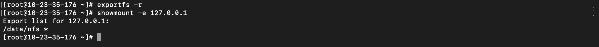


### 第三步、安装Docker

在master及node中安装Docker

**3.1 安装docker **


>安装Docker 
>```
>curl -fsSL https://get.docker.com | bash -s docker --mirror Aliyun
>```
>
>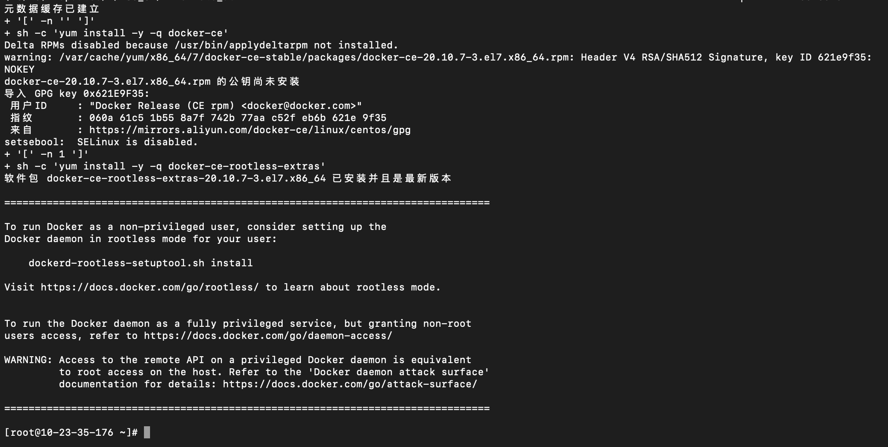
>
>检查Docker版本
>
>```
>docker --version
>```
>
>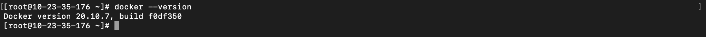

**3.2 配置Docker**

> 创建Docker配置文件目录
>
> ```
> mkdir /etc/docker
> ```
>
> 修改Docker配置
>
> ```
> cat > /etc/docker/daemon.json << EOF
> {
> "exec-opts": ["native.cgroupdriver=systemd"], "log-driver": "json-file",
> "log-opts": {
> "max-size": "100m" },
> "storage-driver": "overlay2", "storage-opts": [
> "overlay2.override_kernel_check=true"
> ]
> }
> EOF
> ```
>
> 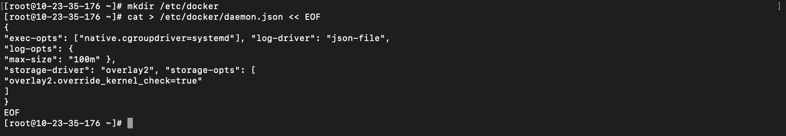

**3.3 启动Docker**

>执行以下命令
>
>```
>gpasswd -a ${USER} docker
>mkdir -p /etc/systemd/system/docker.service.d
>systemctl daemon-reload
>systemctl enable docker && systemctl start docker
>```
>
>


### 第四步、部署K8S

##### 4.1 在master及node中部署K8S

>**4.1.1 搭建K8S环境**
>
>>配置iptable
>>```
>>cat <<EOF | sudo tee /etc/sysctl.d/k8s.conf
>>net.bridge.bridge-nf-call-ip6tables = 1
>>net.bridge.bridge-nf-call-iptables = 1
>>EOF
>>```
>>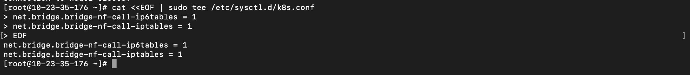
>>
>>配置iptable生效
>>
>>```
>>sudo sysctl --system
>>```
>>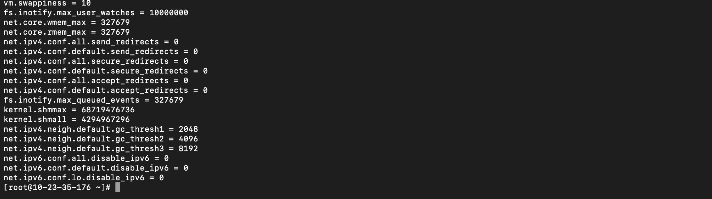
>
>**4.1.2 安装K8S依赖**
>
>>```
>>cat <<EOF > /etc/yum.repos.d/kubernetes.repo
>>[kubernetes]
>>name=Kubernetes 
>>baseurl=https://mirrors.aliyun.com/kubernetes/yum/repos/kubernetes-el7-x86_64/
>>enabled=1
>>gpgcheck=1
>>repo_gpgcheck=1 
>>gpgkey=https://mirrors.aliyun.com/kubernetes/yum/doc/yum-key.gpg https://mirrors.aliyun.com/kubernetes/yum/doc/rpm-package-key.gpg
>>EOF
>>```
>>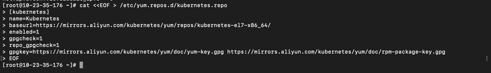
>>
>>完成上述操作后执行以下命令
>>
>>```
>>setenforce 0
>>sed -i 's/^SELINUX=enforcing$/SELINUX=permissive/' /etc/selinux/config
>>```
>>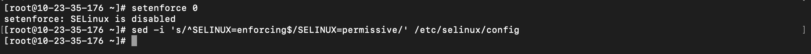
>
>**4.1.3 安装K8S并启动**
>
>>安装K8S
>>```
>>yum install -y kubelet-1.19.4 kubeadm-1.19.4 kubectl-1.19.4
>>```
>>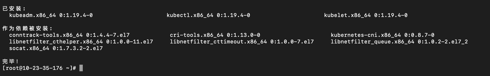
>>
>>启动K8S
>>
>>```
>>systemctl enable --now kubelet
>>```
>>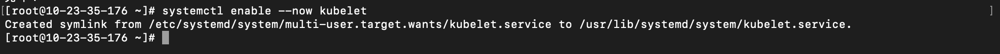

##### 4.2 创建 K8S master

>在master上执行以下命令
>
>```
>kubeadm init --kubernetes-version=v1.19.4 --image-repository registry.aliyuncs.com/google_containers --pod-network-cidr=10.244.0.0/16 --ignore-preflight-errors=Swap
>```
>
>保存加节点信息以便后续加K8S节点使用
>
>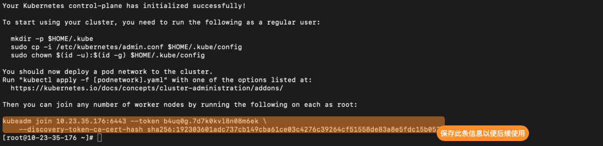
>
>配置kubectl
>
>    ```
>mkdir -p $HOME/.kube
>sudo cp -i /etc/kubernetes/admin.conf $HOME/.kube/config 
>sudo chown $(id -u):$(id -g) $HOME/.kube/config
>```

##### 4.3 将node添加到master

>在node中执行以下命令
>
>```
>swapoff -a
>${4.2保存的信息}
>    ```
>
>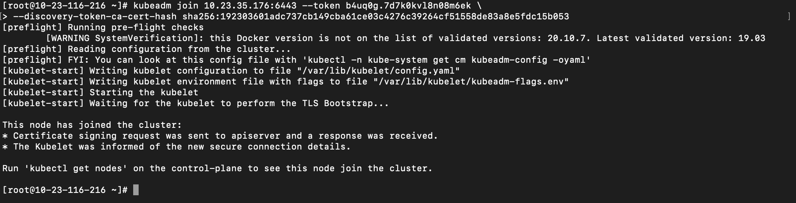
>
>

##### 4.4 查看K8S部署情况

>在master中执行以下命令
>
>```
>kubectl get pod --all-namespaces
>```
>
>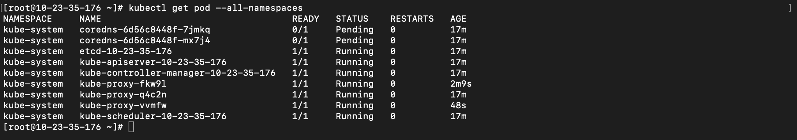

##### 4.5 部署K8S网络

>在主节点进行K8S的网络部署，执行以下命令
>
>```
>kubectl apply -f https://raw.githubusercontent.com/coreos/flannel/master/Documentation/kube-flannel.yml
>```
>
>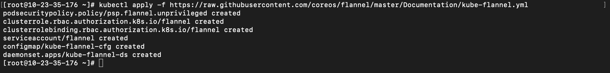
>
>检查网络，执行
>
>```
>kubectl get pod -n kube-system
>```
>
>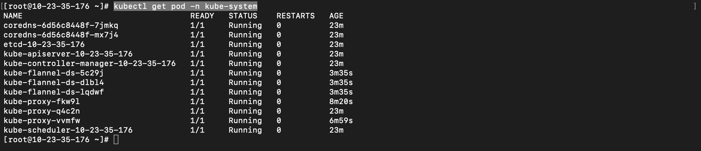


### 第五步，安装IoT Stack系统

##### 5.1 下载安装包
>master下载系统安装包，执行命令
>```
>wget http://iotstack-deploy.cn-sh2.ufileos.com/k8s_cluster_v1.4.0.zip
>```
>
>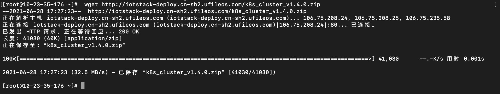
>
>执行命令进行文件解压缩
>
>```
>unzip k8s_cluster_v1.4.0.zip
>```
>
>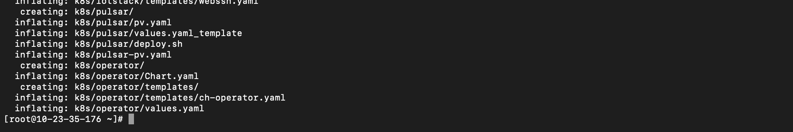

##### 5.2 配置集群信息

>查询master、node信息以便后续配置信息使用，执行以下命令
>
>```
>kubectl get no -o wide
>```
>
>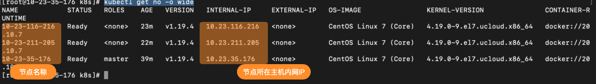
>
>修改depoy.sh文件进行配置
>
>```
>vim deploy.sh 
>```
>
>> 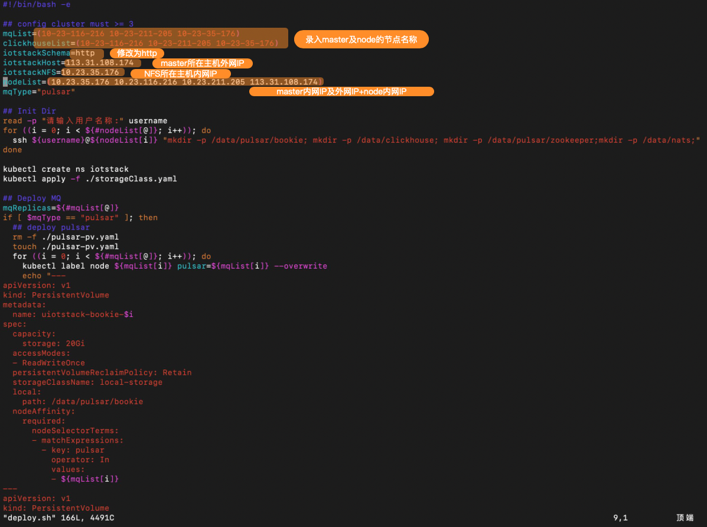
>>
>> 修改信息如下：
>>
>> ```
>> mqList=(${master名称} ${node1名称} ${node2名称})                                                       #需修改#
>> clickhouseList=(${master名称} ${node1名称} ${node2名称})                                               #需修改#
>> iotstackSchema=http                                                                                  #需修改#
>> iotstackHost=${master所在主机外网IP}                                                                   #需修改#
>> iotstackNFS=${NFS所在主机外网IP}                                                                       #需修改#
>> nodeList=(${master所在主机外网IP} ${master所在主机内网IP} ${node1所在主机内网IP} ${node2所在主机内网IP})     #需修改#
>> ```
>>
>> 

##### 5.3 配置K8S主从节点调度

>执行以下命令
>
>```
>kubectl taint node 10-23-35-176 node-role.kubernetes.io/master-
>```
>
>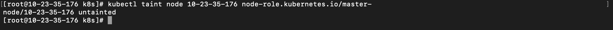

##### 5.4 安装helm

>执行命令
>
>```
>curl https://raw.githubusercontent.com/helm/helm/master/scripts/get > get_helm.sh
>chmod 700 get_helm.sh
>./get_helm.sh
>```

##### 5.5 安装IoT Stack

>执行程序deploy.sh
>
>```
>./deploy.sh
>```
>
>按照提示录入master及node 所在主机的账号及密码
>
>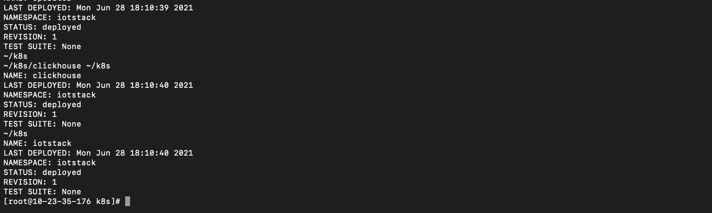
>
>查看IoT Stack 运行情况,所有服务为“running”即为部署及运行成功。
>
>```
>kubectl -n iotstack get po
>```
>
>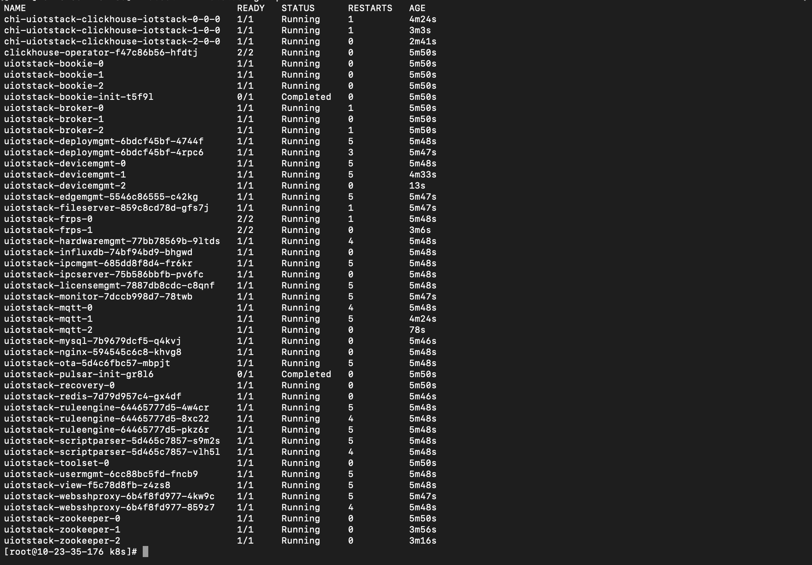


### 完成部署

完成以上步骤即完成全部安装。可通过浏览器访问WEB控制台，地址为http://IP:80 

账号为：admin 密码：iotstack

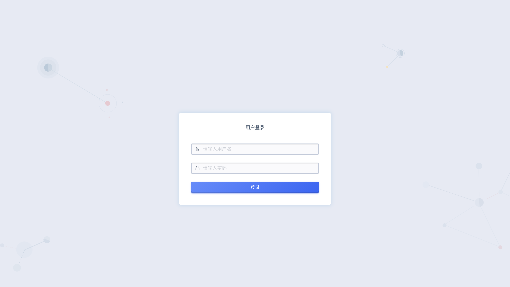
